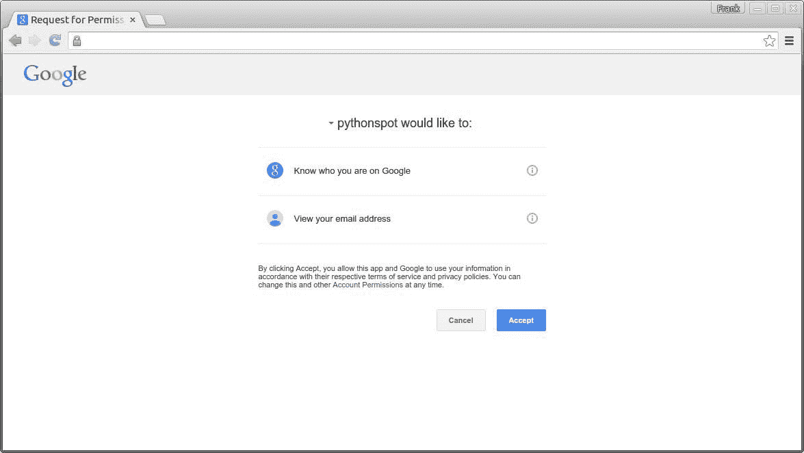

# 使用 Google 登录到您的 Flask 应用

> 原文： [https://pythonspot.com/login-to-flask-app-with-google/](https://pythonspot.com/login-to-flask-app-with-google/)

在本文中，您将学习如何在 Flask 应用中使用 Google 进行登录身份验证。 您可以使用 Google 来对您的网站进行身份验证，而不是使用自定义用户登录系统。 您的访问者可能已经在 Google 上拥有一个帐户，为什么不使用它登录？

为此，我们使用称为 OAuth 的协议。 从维基百科：

> OAuth 是一种使用令牌来代表资源所有者访问资源的协议。 考虑使用户能够对网站的某些部分发出代客密钥。 许多网站，例如 Google，Facebook 和 Twitter，都使用 OAuth 来认证第三方客户端，以便访问某些用户资源。

Don’t worry if that sounds vague, we’ll take you through the steps.

## 与 Google 的登录身份验证

我们使用名为 **flask_oauth** 的模块向 Google 进行身份验证。 它由 Flask 的创建者 Armin Ronacher 维护，因此可以确保该模块不会消失。 该模块使用 OAuth，该协议提供令牌以访问资源。 其他模块可能没有很好的支持。

复制下面的代码，并设置您从上面的 Google 获得的**客户端 ID** 和**客户端密钥**。 只需替换以下行：

```py
GOOGLE_CLIENT_ID = 'PUT CLIENT ID'
GOOGLE_CLIENT_SECRET = 'PUT CLIENT SECRET'

```

将程序另存为 app.py

```py
from flask import Flask, redirect, url_for, session
from flask_oauth import OAuth

# You must configure these 3 values from Google APIs console
# https://code.google.com/apis/console
GOOGLE_CLIENT_ID = 'PUT CLIENT ID'
GOOGLE_CLIENT_SECRET = 'PUT CLIENT SECRET'
REDIRECT_URI = '/oauth2callback'  # one of the Redirect URIs from Google APIs console

SECRET_KEY = 'development key'
DEBUG = True

app = Flask(__name__)
app.debug = DEBUG
app.secret_key = SECRET_KEY
oauth = OAuth()

google = oauth.remote_app('google',
base_url='https://www.google.com/accounts/',
authorize_url='https://accounts.google.com/o/oauth2/auth',
request_token_url=None,
request_token_params={'scope': 'https://www.googleapis.com/auth/userinfo.email',
'response_type': 'code'},
access_token_url='https://accounts.google.com/o/oauth2/token',
access_token_method='POST',
access_token_params={'grant_type': 'authorization_code'},
consumer_key=GOOGLE_CLIENT_ID,
consumer_secret=GOOGLE_CLIENT_SECRET)

@app.route('/')
def index():
access_token = session.get('access_token')
if access_token is None:
return redirect(url_for('login'))

access_token = access_token[0]
from urllib2 import Request, urlopen, URLError

headers = {'Authorization': 'OAuth '+access_token}
req = Request('https://www.googleapis.com/oauth2/v1/userinfo',
None, headers)
try:
res = urlopen(req)
except URLError, e:
if e.code == 401:
# Unauthorized - bad token
session.pop('access_token', None)
return redirect(url_for('login'))
return res.read()

return res.read()

@app.route('/login')
def login():
callback=url_for('authorized', _external=True)
return google.authorize(callback=callback)

@app.route(REDIRECT_URI)
@google.authorized_handler
def authorized(resp):
access_token = resp['access_token']
session['access_token'] = access_token, ''
return redirect(url_for('index'))

@google.tokengetter
def get_access_token():
return session.get('access_token')

def main():
app.run()

if __name__ == '__main__':
main()

```

使用以下命令执行：

```py
python app.py
* Running on http://127.0.0.1:5000/
* Restarting with reloader

```

然后，您可以打开链接以查看登录屏幕。 一旦接受，该应用程序将仅返回以 JSON 格式编码的您的帐户信息。



Login to your Flask app with Google

最后，您可以验证是否在新路由上设置了访问令牌。
[
[下载烧瓶示例](https://pythonspot.com/en/download-flask-examples/)