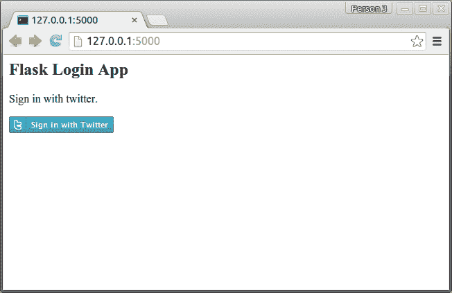
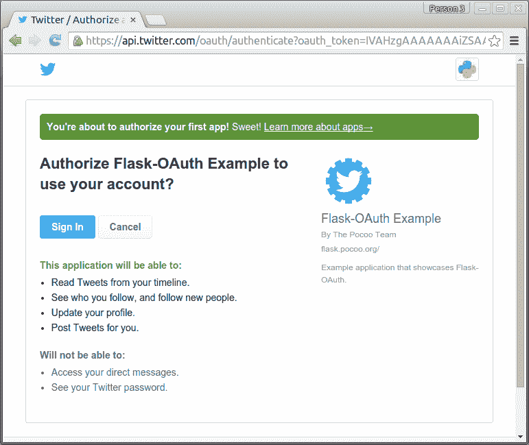
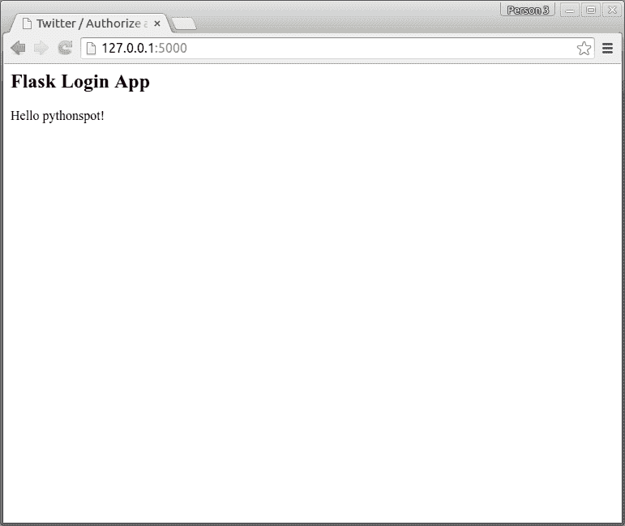

# 使用 Twitter 登录 Flask 应用

> 原文： [https://pythonspot.com/login-to-flask-app-with-twitter/](https://pythonspot.com/login-to-flask-app-with-twitter/)

在本教程中，您将学习如何在 Flask 应用程序中使用 Twitter 进行登录身份验证。 您可以使用 Twitter 对网站进行身份验证，而不是使用自定义用户登录系统。 您的访客可能已经在 Twitter 上拥有一个帐户，那么为什么不使用它登录呢？

为此，我们使用称为 OAuth 的协议。 从维基百科：

> OAuth 是一种使用令牌来代表资源所有者访问资源的协议。 考虑使用户能够对网站的某些部分发出代客密钥。 许多网站，例如 Google，Facebook 和 Twitter，都使用 OAuth 来认证第三方客户端，以便访问某些用户资源。

Don’t worry if that sounds vague, we’ll take you through the steps.

## 代码

创建文件 _app.py_ ，并设置您从 Twitter 获得的 _Consumer_key_ 和 _Consumer_secret_ 。

```py
from flask import Flask, request, redirect, url_for, session, g, flash, \
render_template
from flask_oauth import OAuth

from sqlalchemy import create_engine, Column, Integer, String
from sqlalchemy.orm import scoped_session, sessionmaker
from sqlalchemy.ext.declarative import declarative_base

# configuration
SECRET_KEY = 'development key'
DEBUG = True

# setup flask
app = Flask(__name__)
app.debug = DEBUG
app.secret_key = SECRET_KEY
oauth = OAuth()

# Use Twitter as example remote application
twitter = oauth.remote_app('twitter',
# unless absolute urls are used to make requests, this will be added
# before all URLs.  This is also true for request_token_url and others.
base_url='https://api.twitter.com/1/',
# where flask should look for new request tokens
request_token_url='https://api.twitter.com/oauth/request_token',
# where flask should exchange the token with the remote application
access_token_url='https://api.twitter.com/oauth/access_token',
# twitter knows two authorizatiom URLs.  /authorize and /authenticate.
# they mostly work the same, but for sign on /authenticate is
# expected because this will give the user a slightly different
# user interface on the twitter side.
authorize_url='https://api.twitter.com/oauth/authenticate',
# the consumer keys from the twitter application registry.
consumer_key='ADD TWITTER CONSUMER KEY',
consumer_secret='ADD TWITTER CONSUMER SECRET'
)

@twitter.tokengetter
def get_twitter_token(token=None):
return session.get('twitter_token')

@app.route('/')
def index():
access_token = session.get('access_token')
if access_token is None:
return redirect(url_for('login'))

access_token = access_token[0]

return render_template('index.html')

@app.route('/login')
def login():
return twitter.authorize(callback=url_for('oauth_authorized',
next=request.args.get('next') or request.referrer or None))

@app.route('/logout')
def logout():
session.pop('screen_name', None)
flash('You were signed out')
return redirect(request.referrer or url_for('index'))

@app.route('/oauth-authorized')
@twitter.authorized_handler
def oauth_authorized(resp):
next_url = request.args.get('next') or url_for('index')
if resp is None:
flash(u'You denied the request to sign in.')
return redirect(next_url)

access_token = resp['oauth_token']
session['access_token'] = access_token
session['screen_name'] = resp['screen_name']

session['twitter_token'] = (
resp['oauth_token'],
resp['oauth_token_secret']
)

return redirect(url_for('index'))

if __name__ == '__main__':
app.run()

```

使用文件 index.html 创建目录/ templates /

```py
&#123;% block body %&#125;
<h2>Flask Login App</h2>
&#123;% if session['screen_name'] %&#125;
Hello &#123; &#123; session['screen_name'] &#125;&#125;!
&#123;% else %&#125;

Sign in with twitter.

<a href="&#123; &#123; url_for('login') &#125;&#125;"></a>
&#123;% endif %&#125;
&#123;% endblock %&#125;

```

最后，使用图像 sign-in.png 创建目录/ static /：


通过以下方式启动您的应用：

```py
python app.py

```

在您的网络浏览器中打开该应用程序。 然后，您的用户只需按照以下步骤登录：



Flask Login Twitter Screen 

Flask OAuth Twitter 

twitter_oauth

[下载烧瓶示例](https://pythonspot.com/download-flask-examples/)