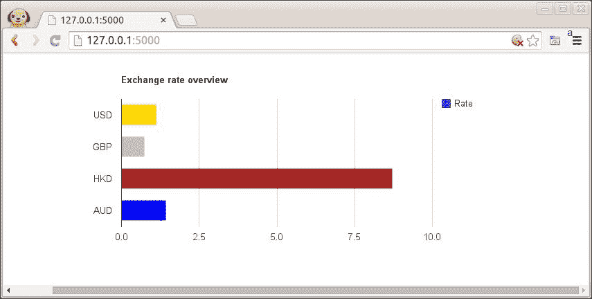

# Flask，JSON 和 Google Charts API

> 原文： [https://pythonspot.com/flask-json-and-the-google-charts-api/](https://pythonspot.com/flask-json-and-the-google-charts-api/)

本教程将教您如何构建结合 JSON 和 Google Charts API 的 Flask 应用。 如果您在阅读 Flask 之前没有任何经验，我建议您阅读以前的教程，那么它们会很有趣！

## 获取 JSON 数据

To display awesome charts we first need some data. There are two common ways to get data in web apps: data from servers using an API (usually JSON) and data from databases. I use the Fixer.io JSON API to get some financial data, but any JSON API should do. If you are unfamiliar with [JSON, see this article.](https://pythonspot.com/json-encoding-and-decoding-with-python/)

我们编写此脚本来获取汇率：

```py
import json
import urllib2

def getExchangeRates():
rates = []
response = urllib2.urlopen('http://api.fixer.io/latest')
data = response.read()
rdata = json.loads(data, parse_float=float)

rates.append( rdata['rates']['USD'] )
rates.append( rdata['rates']['GBP'] )
rates.append( rdata['rates']['JPY'] )
rates.append( rdata['rates']['AUD'] )
return rates

rates = getExchangeRates()
print rates

```

## 使用 Flask 的 Google Charts API

With the [Google Charts API](https://developers.google.com/chart/interactive/docs/gallery) you can display live data on your site. There are a lot of great charts there that are easy to add to your Flask app. We simply give the data that we got from the server through JSON and parsed, to the Google Charts API.

为目录创建带有目录/ templates /的 flask 应用程序。 这是 Flask 的主要代码：

```py
from flask import Flask, flash, redirect, render_template, request, session, abort
import os
import json
import urllib2

tmpl_dir = os.path.join(os.path.dirname(os.path.abspath(__file__)), 'templates')
app = Flask(__name__, template_folder=tmpl_dir)

def getExchangeRates():
rates = []
response = urllib2.urlopen('http://api.fixer.io/latest')
data = response.read()
rdata = json.loads(data, parse_float=float)

rates.append( rdata['rates']['USD'] )
rates.append( rdata['rates']['GBP'] )
rates.append( rdata['rates']['HKD'] )
rates.append( rdata['rates']['AUD'] )
return rates

@app.route("/")
def index():
rates = getExchangeRates()
return render_template('test.html',**locals())

@app.route("/hello")
def hello():
return "Hello World!"

if __name__ == "__main__":
app.run()

```

我们有这个模板：

```py
1
2
3
4
5
6
7
8
9
10
11
12
13
14
15
16
17
18
19
20
21
22
23
24
25
26
27
28
29
30
31
32
33
34
35
36

```

结果：

<caption id=”attachment_770” align=”alignnone” width=”855”]

Flask App

[下载烧瓶示例](https://pythonspot.com/download-flask-examples/)