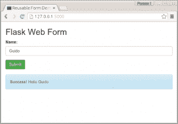
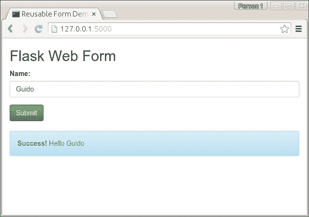
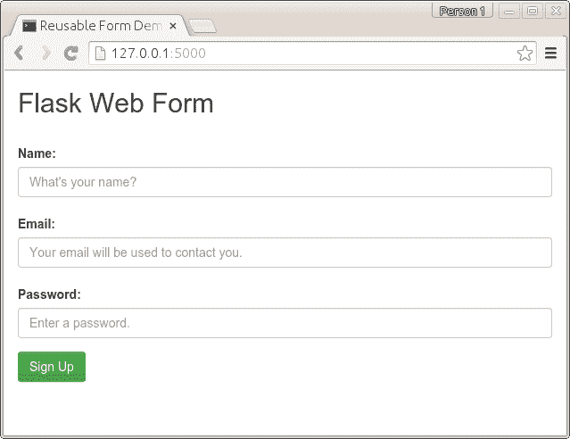

# 烧瓶网页表单

> 原文： [https://pythonspot.com/flask-web-forms/](https://pythonspot.com/flask-web-forms/)



Flask web form

在本教程中，您将学习如何使用 Flask 进行表单验证。 表单在所有 Web 应用程序中都扮演着重要角色。

我们使用 WTForms，这是用于验证表单的模块。 我们将从一个简单的表格开始，其中包含一个要求输入名称的字段。

## CSS 与烧瓶

We use bootstrap to style the form.Bootstrap is a popular HTML, CSS, and JS framework for developing responsive, mobile first projects on the web. It makes front-end web development faster and easier. The output will be:



Flask wtforms

您可以从 [http://getbootstrap.com/getting-started/#download](https://getbootstrap.com/getting-started/#download) 获取引导文件，并将其解压缩到新目录/ static /中。 代码几乎相同，但是模板已更改。 码：

```py
from flask import Flask, render_template, flash, request
from wtforms import Form, TextField, TextAreaField, validators, StringField, SubmitField

# App config.
DEBUG = True
app = Flask(__name__)
app.config.from_object(__name__)
app.config['SECRET_KEY'] = '7d441f27d441f27567d441f2b6176a'

class ReusableForm(Form):
    name = TextField('Name:', validators=[validators.required()])

    @app.route("/", methods=['GET', 'POST'])
    def hello():
        form = ReusableForm(request.form)

        print form.errors
        if request.method == 'POST':
        name=request.form['name']
        print name

        if form.validate():
        # Save the comment here.
            flash('Hello ' + name)
        else:
            flash('Error: All the form fields are required. ')

        return render_template('hello.html', form=form)

if __name__ == "__main__":
    app.run()

```

我们在模板 hello.html 中添加了引导程序：

```py

<title>Reusable Form Demo</title>
        	 	<link rel="stylesheet" media="screen" href="static/bootstrap.min.css">
        	 	<link rel="stylesheet" href="static/bootstrap-theme.min.css">
       <meta name="viewport" content="width=device-width, initial-scale=1.0">
<div class="container">
<h2>Flask Web Form</h2>
<form action="" method="post" role="form">
    { { form.csrf }}
<div class="form-group">
      <label for="name">Name:</label>
<input type="text" class="form-control" id="name" name="name" placeholder="What's your name?"></div>
<button type="submit" class="btn btn-success">Submit</button>
</form>




<div class="alert alert-info">
                <strong>Success! </strong> { { message[1] }}</div>



<div class="alert alert-warning">
                { { message[1] }}</div>





</div>

```

## 烧瓶登记表

We use the same principle to create a registration form asking for name, email and password. We update the Form class:

```py
class ReusableForm(Form):
    name = TextField('Name:', validators=[validators.required()])
    email = TextField('Email:', validators=[validators.required(), validators.Length(min=6, max=35)])
    password = TextField('Password:', validators=[validators.required(), validators.Length(min=3, max=35)])

    def reset(self):
        blankData = MultiDict([ ('csrf', self.reset_csrf() ) ])
        self.process(blankData)

```

我们可以使用以下方法传递变量：

```py
name=request.form['name']
password=request.form['password']
email=request.form['email']

```

完整代码：

```py
from flask import Flask, render_template, flash, request
from wtforms import Form, TextField, TextAreaField, validators, StringField, SubmitField

# App config.
DEBUG = True
app = Flask(__name__)
app.config.from_object(__name__)
app.config['SECRET_KEY'] = '7d441f27d441f27567d441f2b6176a'

class ReusableForm(Form):
    name = TextField('Name:', validators=[validators.required()])
    email = TextField('Email:', validators=[validators.required(), validators.Length(min=6, max=35)])
    password = TextField('Password:', validators=[validators.required(), validators.Length(min=3, max=35)])

    @app.route("/", methods=['GET', 'POST'])
    def hello():
        form = ReusableForm(request.form)

        print form.errors
        if request.method == 'POST':
            name=request.form['name']
            password=request.form['password']
            email=request.form['email']
            print name, " ", email, " ", password

        if form.validate():
        # Save the comment here.
            flash('Thanks for registration ' + name)
        else:
            flash('Error: All the form fields are required. ')

        return render_template('hello.html', form=form)

if __name__ == "__main__":
    app.run()

```

使用以下代码更新模板 hello.html：

```py

<title>Reusable Form Demo</title>
        	 	<link rel="stylesheet" media="screen" href="static/bootstrap.min.css">
        	 	<link rel="stylesheet" href="static/bootstrap-theme.min.css">
       <meta name="viewport" content="width=device-width, initial-scale=1.0">
<div class="container">
<h2>Flask Web Form</h2>
<form action="" method="post" role="form">
    { { form.csrf }}
<div class="form-group">
      <label for="name">Name:</label>
<input type="text" class="form-control" id="name" name="name" placeholder="What's your name?">

<label for="email">Email:</label>
<input type="text" class="form-control" id="email" name="email" placeholder="Your email will be used to contact you.">

<label for="password">Password:</label>
<input type="password" class="form-control" id="password" name="password" placeholder="Enter a password.">

</div>
<button type="submit" class="btn btn-success">Sign Up</button>
</form>




<div class="alert alert-info">
                <strong>Success! </strong> { { message[1] }}</div>



<div class="alert alert-warning">
                { { message[1] }}</div>





</div>

```

输出：



flask form bootstrap

[下载烧瓶示例](/download-flask-examples/)

WTForms 可以验证电子邮件，密码，数字等等。 有关验证器的列表，请参见： [http://wtforms.readthedocs.org/en/latest/validators.html](https://wtforms.readthedocs.org/en/latest/validators.html)