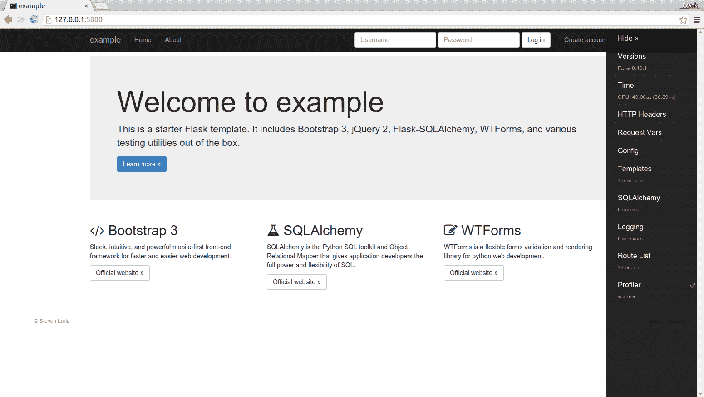

# Flask 模板，SQLAlchemy 和 Bootstarp

> 原文： [https://pythonspot.com/flask-boilerplate-with-bootstrap-sqlalchemy/](https://pythonspot.com/flask-boilerplate-with-bootstrap-sqlalchemy/)

在本文中，您将学习 cookiecutter，这是一个从项目模板创建项目的命令行实用程序。 使用 cookiecutter，您可以创建一个新的 python Flask 项目。 这类似于标准的 Flask 项目，除了使用此方法时，您将从几个完整的模板和功能列表开始。

功能

*   具有入门模板的 Bootstrap 3 和 Font Awesome 4
*   具有基本用户模型的 Flask-SQLAlchemy
*   使用 Flask-Migrate 轻松进行数据库迁移
*   带登录和注册表格的 Flask-WTForms
*   Flask-Login 进行身份验证
*   Flask-Bcrypt 用于密码哈希
*   用于部署到 PaaS 的 Procfile（例如 Heroku）
*   pytest 和 Factory-Boy 进行测试（包括示例测试）
*   一个简单的`manage.py`脚本。
*   使用 Flask-Assets 缩小 CSS 和 JS
*   可选的 Bower 支持前端程序包管理
*   使用 Flask-Cache 进行缓存
*   有用的调试工具栏
*   利用最佳实践：蓝图和 Application Factory 模式

安装 Flask 依赖项：

```py
sudo pip install flask_script
sudo pip install flask_migrate
sudo pip install flask_assets
sudo pip install flask_bcrypt
sudo pip install flask_cache
sudo pip install flask_debugtoolbar

```

安装并克隆 cookieclutter

```py
sudo pip install cookiecutter
sudo pip install mock==1.0.1
cookiecutter https://github.com/sloria/cookiecutter-flask.git

```

系统将询问您有关项目的一些信息，并根据需要输入：

```py
remote: Counting objects: 1545, done.
remote: Total 1545 (delta 0), reused 0 (delta 0), pack-reused 1545
Receiving objects: 100% (1545/1545), 1.57 MiB | 720.00 KiB/s, done.
Resolving deltas: 100% (857/857), done.
Checking connectivity... done.
full_name (default is "Steven Loria")? Steven Loria
email (default is "[email protected]")?  [email protected]
github_username (default is "sloria")?  sloria
project_name (default is "My Flask App")? example
app_name (default is "myflaskapp")? example
project_short_description (default is "A flasky app.")? a flasky app

```

然后输入您的项目目录（示例）并启动服务器

```py
cd example
python manage.py runserver

```

然后，您可以打开 [http://127.0.0.1:5000](http://127.0.0.1:5000)



cookiecutter output theme