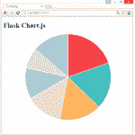
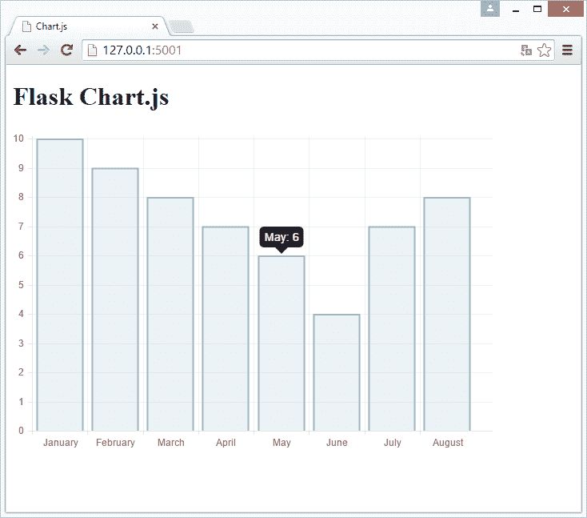
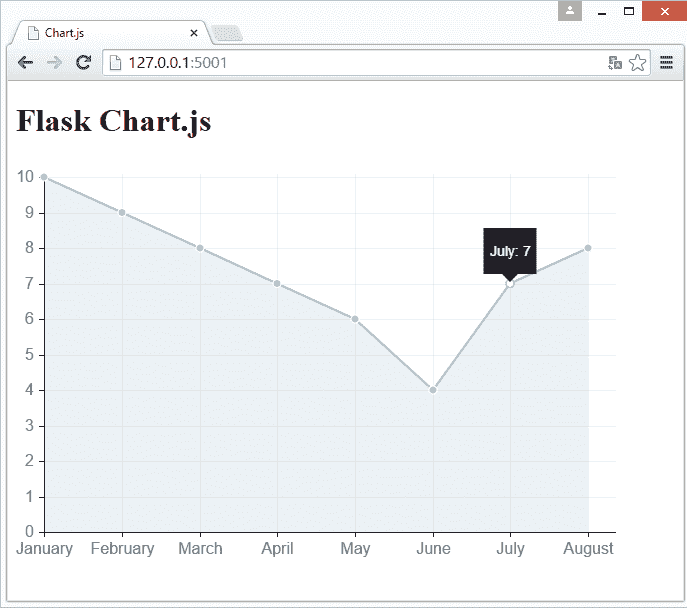
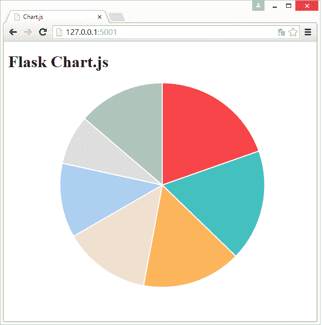

# Flask 和使用 Chart.js 的美观的图表

> 原文： [https://pythonspot.com/flask-and-great-looking-charts-using-chart-js/](https://pythonspot.com/flask-and-great-looking-charts-using-chart-js/)



带有饼图的 Flask webapp

在本文中，您将学习如何使用 [Chart.js](http://www.chartjs.org) 和 [Flask](/ python-flask-tutorials)。

Chart.js 是一个 JavaScript 库，用于创建简单干净的图表。它们都是基于 HTML5 的，响应式的，模块化的，交互式的，共有 6 个图表。


```py
   <meta charset="utf-8">   <title>Chart.js </title>      <!-- import plugin script -->   <script src="static/Chart.min.js"></script>
<h1>Flask Chart.js</h1>
<!-- bar chart canvas element --><canvas id="chart" width="600" height="400"></canvas>
<script><br />
   // bar chart data<br />
   var barData = {<br />
   labels : [],<br />
   datasets : [<br />
      {<br />
            fillColor: "rgba(151,187,205,0.2)",<br />
            strokeColor: "rgba(151,187,205,1)",<br />
            pointColor: "rgba(151,187,205,1)",<br />
         data : []<br />
      }<br />
      ]<br />
   }</p>
<p>   // get bar chart canvas<br />
   var mychart = document.getElementById("chart").getContext("2d");</p>
<p>   steps = 10<br />
   max = 10<br />
   // draw bar chart<br />
   new Chart(mychart).Bar(barData, {<br />
        scaleOverride: true,<br />
        scaleSteps: steps,<br />
        scaleStepWidth: Math.ceil(max / steps),<br />
        scaleStartValue: 0,<br />
        scaleShowVerticalLines: true,<br />
        scaleShowGridLines : true,<br />
        barShowStroke : true,<br />
        scaleShowLabels: true<br />
   });</p>
<p></script>

```

创建目录`/static/`并将文件[`Chart.min.js`](https://cdnjs.cloudflare.com/ajax/libs/Chart.js/1.0.2/Chart.min.js)添加到其中。您可以从 Chart.js 网站获得它，也可以使用链接。 最后进入主目录并使用以下内容创建`app.py`：

```py
from flask import Flask
from flask import Markup
from flask import Flask
from flask import render_template
app = Flask(__name__)

@app.route("/")
def chart():
labels = ["January","February","March","April","May","June","July","August"]
values = [10,9,8,7,6,4,7,8]
return render_template('chart.html', values=values, labels=labels)

if __name__ == "__main__":
app.run(host='0.0.0.0', port=5001)

```

最后运行：

```py
python app.py

```

打开 [http://127.0.0.1:5001/](http://127.0.0.1:5001/)，您会看到数组`values[]`与数据中的`labels[]`一起绘制。

我们只需将这两个数组传递给`render_template()`即可。这意味着大多数魔术都发生在模板中。 Chart.js 是一个客户端 javascript 库，因此我们的`app.py`非常少。

结果：



Flask 条形图

### 使用 Chart.js 和 Flask 创建折线图

要创建折线图，我们只需修改`chart.html`模板即可。 更改为：

```py
<meta charset="utf-8">
<title>Chart.js </title>

<!-- import plugin script -->
<script src="static/Chart.min.js"></script>
<h1>Flask Chart.js</h1>
<!-- bar chart canvas element -->
<canvas id="chart" width="600" height="400"></canvas>

<script></p>
<p>   // bar chart data<br />
   var barData = {<br />
   labels : [],<br />
   datasets : [<br />
      {<br />
            fillColor: "rgba(151,187,205,0.2)",<br />
            strokeColor: "rgba(151,187,205,1)",<br />
            pointColor: "rgba(151,187,205,1)",<br />
            pointStrokeColor: "#fff",<br />
            pointHighlightFill: "#fff",<br />
            pointHighlightStroke: "rgba(151,187,205,1)",<br />
            bezierCurve : false,<br />
            data : []<br />
      }]<br />
   }</p>
<p>    Chart.defaults.global.animationSteps = 50;<br />
    Chart.defaults.global.tooltipYPadding = 16;<br />
    Chart.defaults.global.tooltipCornerRadius = 0;<br />
    Chart.defaults.global.tooltipTitleFontStyle = "normal";<br />
    Chart.defaults.global.tooltipFillColor = "rgba(0,0,0,0.8)";<br />
    Chart.defaults.global.animationEasing = "easeOutBounce";<br />
    Chart.defaults.global.responsive = false;<br />
    Chart.defaults.global.scaleLineColor = "black";<br />
    Chart.defaults.global.scaleFontSize = 16;</p>
<p>   // get bar chart canvas<br />
   var mychart = document.getElementById("chart").getContext("2d");</p>
<p>   steps = 10<br />
   max = 10<br />
   // draw bar chart<br />
   var LineChartDemo = new Chart(mychart).Line(barData, {<br />
        scaleOverride: true,<br />
        scaleSteps: steps,<br />
        scaleStepWidth: Math.ceil(max / steps),<br />
        scaleStartValue: 0,<br />
        scaleShowVerticalLines: true,<br />
        scaleShowGridLines : true,<br />
        barShowStroke : true,<br />
        scaleShowLabels: true,<br />
        bezierCurve: false,</p>
<p>   });</p>
<p></script>

```

输出：

[&lt;picture&gt;&lt;source srcset="/wp-content/uploads/2015/07/linechart.png.webp" type="image/webp"&gt; &lt;source srcset="/wp-content/uploads/2015/07/linechart.png" type="image/jpeg"&gt;  &lt;/picture&gt;](/wp-content/uploads/2015/07/linechart.png) 烧瓶线形图

### 创建饼图

要创建饼图，我们必须稍加修改应用程序代码。 我们需要 3 个数组：值，标签和颜色。 与 HTML 一样，颜色以十六进制定义。 要在一个循环中对其进行迭代，请压缩它们。

```py
from flask import Flask
from flask import Markup
from flask import Flask
from flask import render_template
app = Flask(__name__)

@app.route("/")
def chart():
labels = ["January","February","March","April","May","June","July","August"]
values = [10,9,8,7,6,4,7,8]
colors = [ "#F7464A", "#46BFBD", "#FDB45C", "#FEDCBA","#ABCDEF", "#DDDDDD", "#ABCABC"  ]
return render_template('chart.html', set=zip(values, labels, colors))

if __name__ == "__main__":
app.run(host='0.0.0.0', port=5001)

```

其次，我们将模板修改为：

```py
   <meta charset="utf-8">   <title>Chart.js </title>      <!-- import plugin script -->   <script src="static/Chart.min.js"></script>
<h1>Flask Chart.js</h1>
<!-- bar chart canvas element --><canvas id="chart" width="600" height="400"></canvas>
<script><br />
   var pieData = [<br />
            </p>
<p>         ];</p>
<p>   // get bar chart canvas<br />
   var mychart = document.getElementById("chart").getContext("2d");</p>
<p>   steps = 10<br />
   max = 10<br />
   // draw pie chart<br />
   new Chart(document.getElementById("chart").getContext("2d")).Pie(pieData);</p>
<p></script>

```

结果：



Flask 饼图

[下载 Flask 示例](https://pythonspot.com/download-flask-examples/)