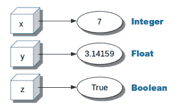

# Python 变量

> 原文： [https://pythonspot.com/python-variables/](https://pythonspot.com/python-variables/)

<figure aria-describedby="caption-attachment-4776" class="wp-caption alignright" id="attachment_4776" style="width: 300px">

<figcaption class="wp-caption-text" id="caption-attachment-4776">Variables in Python (x,y,z). They can be used later in the program</figcaption>

</figure>

变量可以保存您可以使用一次或多次的数字。

数字可以是以下数据类型之一：

*   整数 _（1,2,3,4）_

*   浮点 _（点后面的数字）_

*   布尔值 _（对或错）_

## Related Course:

[Python Programming Bootcamp: Go from zero to hero](https://gum.co/dcsp)

## 数值变量示例

Example of numeric variables:

```py
x = 1
y = 1.234
z = True

```

您可以使用 print（）函数将它们输出到屏幕上。

```py
x = 1
y = 1.234
z = True

print(x)
print(y)
print(z)

```

Python 支持算术运算，例如加法（+），乘法（*），除法（/）和减法（-）。

```py
#!/usr/bin/env python

x = 3
y = 8

sum = x + y

print(sum)

```

[更多数学运算](https://pythonspot.com/math-operations/)

## 用户输入

## Python 3

Use the input() function to get text input, convert to a number using int() or float().

```py
#!/usr/bin/env python

x = int(input("Enter x:"))
y = int(input("Enter y:"))

sum = x + y
print(sum)

```

**Python 2** （旧版本）
您也可以使用 _raw_input_ 函数要求用户输入：

```py
#!/usr/bin/env python

x = int(raw_input("Enter x:"))
y = int(raw_input("Enter y:"))

sum = x + y
print(sum)

```

[下载 Python 练习](https://pythonspot.com/download-python-exercises/)