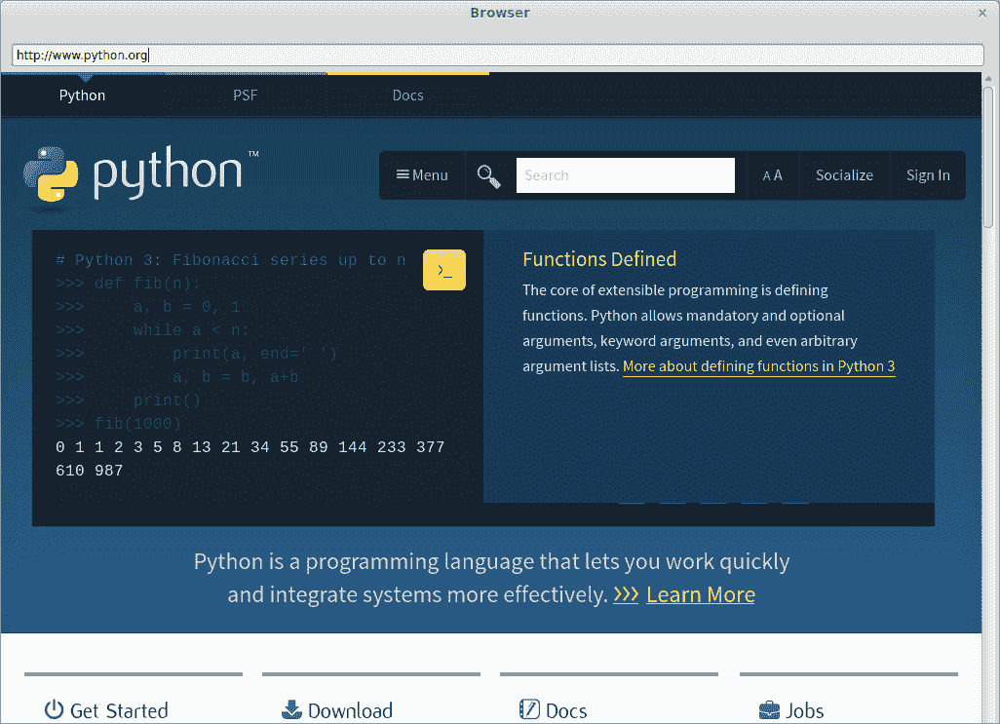
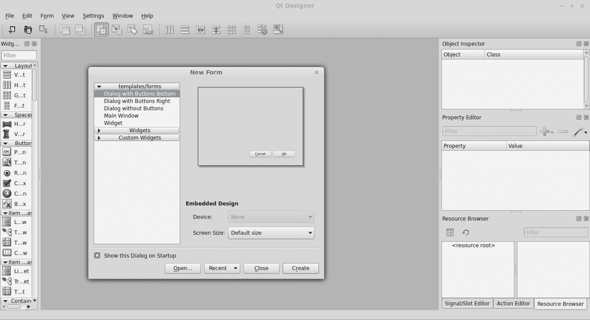

# 使用 Python 和 PyQT 创建 Web 浏览器

> 原文： [https://pythonspot.com/creating-a-webbrowser-with-python-and-pyqt-tutorial/](https://pythonspot.com/creating-a-webbrowser-with-python-and-pyqt-tutorial/)



Python browser with PyQt4

在本教程中，我们将使用 Python 构建一个 Web 浏览器。 我们将使用具有 Web 组件的 [PyQT](https://pythonspot.com/en/pyqt4/) 库。 在本教程中，您将学习如何将所有组件链接在一起。 在本教程中，我们将使用默认的渲染引擎，而不是其中一个。

如果您尚未完成我们的 [pyqt4 初学者教程](https://pythonspot.com/en/building-an-application-gui-with-pyqt-beginners-tutorial/)，则可以尝试一下。 如果找不到 python-kde4，请更新您的存储库以找到它。 [Ubuntu 或 Debian 安装指南](https://packages.ubuntu.com/precise/i386/python-kde4/download)。

## PyQt 安装

Install the required packages:

```py
sudo pip install python-qt4
sudo apt-get install qt4-designer
sudo apt-get install pyqt4-dev-tools
sudo apt-get install python-kde4

```

## 使用 PyQT 创建 GUI

Start qt4-designer from your applications menu. The [QT](https://pythonspot.com/en/pyqt4/) Designer application will appear:

QT_Designer

选择主窗口，然后按创建。 现在，我们打开了设计器窗口。 在窗口上拖动 _KWebView_ 组件。 如果组件列表中有 _QtWebView_ 。 用它代替。 我们还在顶部添加 _Line Edit_ 。 按文件&gt;另存为&gt; browser.ui。 运行命令：

```py
pyuic4 browser.ui &gt; browser.py

```

这将生成一个 Python 文件。 从 browser.py 文件底部删除“ from kwebview import KWebView”行。 将 KWebView 更改为 QtWebView。 我们想改用 QtWebView。 如果您不愿意进行更改，请从下面获取 browser.py 文件。

## QWebView 探索

Create a file called** _r_**_**un.py**_ with this contents:

```py
import sys
from browser import BrowserDialog
from PyQt4 import QtCore, QtGui
from PyQt4.QtCore import QUrl
from PyQt4.QtWebKit import QWebView

class MyBrowser(QtGui.QDialog):
def __init__(self, parent=None):
QtGui.QWidget.__init__(self, parent)
QWebView.__init__(self)
self.ui = BrowserDialog()
self.ui.setupUi(self)
self.ui.lineEdit.returnPressed.connect(self.loadURL)

def loadURL(self):
url = self.ui.lineEdit.text()
self.ui.qwebview.load(QUrl(url))
self.show()
#self.ui.lineEdit.setText("")

if __name__ == "__main__":
app = QtGui.QApplication(sys.argv)
myapp = MyBrowser()
myapp.ui.qwebview.load(QUrl('http://www.pythonspot.com'))
myapp.show()
sys.exit(app.exec_())

```

这段代码将使用 browser.py 中定义的 UI 并向其中添加逻辑。 线

```py
 self.ui.lineEdit.returnPressed.connect(self.loadURL)

def loadURL(self):
url = self.ui.lineEdit.text()
self.ui.qwebview.load(QUrl(url))
self.show()
#self.ui.lineEdit.setText("")

```

第一行定义了回调或事件。 如果有人按下 Enter 键（returnPressed），它将调用函数 loadURL。 确保一旦按下 Enter 键，页面就会加载该功能。 如果您正确执行了所有操作，则应该能够使用以下命令运行浏览器：

```py
python run.py

```

请确保输入完整的网址，例如 ： [http://pythonspot.com](https://pythonspot.com) 包括 http：//部分。 您的浏览器现在应该启动：

<caption id=”attachment_295” align=”alignnone” width=”1026”]

Python browser

如果您的代码未运行，请使用以下代码（或查看不同之处并更改错误之处）：

## browser.py


```py
# -*- coding: utf-8 -*-

# Form implementation generated from reading ui file 'browser.ui'
#
# Created: Fri Jan 30 20:49:32 2015
#      by: PyQt4 UI code generator 4.10.4
#
# WARNING! All changes made in this file will be lost!

import sys
from PyQt4 import QtCore, QtGui
from PyQt4.QtGui import QApplication
from PyQt4.QtCore import QUrl
from PyQt4.QtWebKit import QWebView

try:
_fromUtf8 = QtCore.QString.fromUtf8
except AttributeError:
def _fromUtf8(s):
return s

try:
_encoding = QtGui.QApplication.UnicodeUTF8
def _translate(context, text, disambig):
return QtGui.QApplication.translate(context, text, disambig, _encoding)
except AttributeError:
def _translate(context, text, disambig):
return QtGui.QApplication.translate(context, text, disambig)

class BrowserDialog(object):
def setupUi(self, Dialog):
Dialog.setObjectName(_fromUtf8("Dialog"))
Dialog.resize(1024, 768)
self.qwebview = QWebView(Dialog)
self.qwebview.setGeometry(QtCore.QRect(0, 50, 1020, 711))
self.qwebview.setObjectName(_fromUtf8("kwebview"))
self.lineEdit = QtGui.QLineEdit(Dialog)
self.lineEdit.setGeometry(QtCore.QRect(10, 20, 1000, 25))
self.lineEdit.setObjectName(_fromUtf8("lineEdit"))

self.retranslateUi(Dialog)
QtCore.QMetaObject.connectSlotsByName(Dialog)

def retranslateUi(self, Dialog):
Dialog.setWindowTitle(_translate("Browser", "Browser", None))

```

## run.py


```py
import sys
from browser import BrowserDialog
from PyQt4 import QtCore, QtGui
from PyQt4.QtCore import QUrl
from PyQt4.QtWebKit import QWebView

class MyBrowser(QtGui.QDialog):
def __init__(self, parent=None):
QtGui.QWidget.__init__(self, parent)
QWebView.__init__(self)
self.ui = BrowserDialog()
self.ui.setupUi(self)
self.ui.lineEdit.returnPressed.connect(self.loadURL)

def loadURL(self):
url = self.ui.lineEdit.text()
self.ui.qwebview.load(QUrl(url))
self.show()
#self.ui.lineEdit.setText("")

if __name__ == "__main__":
app = QtGui.QApplication(sys.argv)
myapp = MyBrowser()
myapp.ui.qwebview.load(QUrl('http://www.pythonspot.com'))
myapp.show()
sys.exit(app.exec_())

```

[下载 PyQT 代码（批量收集）](https://pythonspot.com/en/python-qt-examples/)