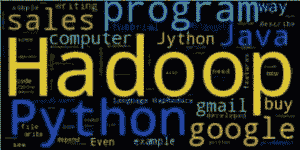

# 创建一个 gmail 词云

> 原文： [https://pythonspot.com/creating-a-gmail-wordcloud/](https://pythonspot.com/creating-a-gmail-wordcloud/)



基于 gmail 的词云

我们创建了一个 python 程序，该程序**根据您的 gmail** 帐户生成一个 wordcloud。 输出内容可能看起来像这样，具体取决于您电子邮件的内容。

首先，您将需要一个与 gmail 服务进行交互的小脚本。 我们创建了一个与 gmail 交互的小脚本。 它依赖于已安装的 [gmaillib](https://github.com/thedjpetersen/gmaillib) ，您需要进行以下设置：允许“不太安全”的应用程序访问 gmail 服务器： [https://www.google.com/settings/security/lesssecureapps](https://www.google.com/settings/security/lesssecureapps)

## Gmail 示例：


```py
#!/usr/bin/env python
import gmaillib
from collections import Counter

def getMails(cnt,account, start,amount):
    emails = account.inbox(start, amount)

    for email in emails:
        cnt[email.sender_addr] += 1

amountOfMails = 100
cnt = Counter()
username = raw_input("Gmail account: ")
password = raw_input("Password: ")

account = gmaillib.account(username, password)

getMails(cnt,account,0,amountOfMails)
print(cnt)

```

如果此脚本成功运行，则说明您已安装了几乎所有要求。 您还将需要名为 [wordcloud](https://github.com/amueller/word_cloud) 的库。 我们重建系统，以便得到一个包含消息主体的长字符串，并将其作为输入输入到 wordcloud 实例中。 可变数量包含要提取的邮件数。 我们已将其设置为 100，但您可以使用 get_inbox_count（）将其设置为所有邮件，也可以仅提取上周的所有电子邮件。

## 最终程序：


```py
#!/usr/bin/env python
import gmaillib
from collections import Counter
from wordcloud import WordCloud
import matplotlib.pyplot as plt

amount = 100
cnt = Counter()
username = raw_input("Gmail account: ")
password = raw_input("Password: ")

account = gmaillib.account(username, password)

emails = account.inbox(0, amount)

data = ""
for email in emails:
    data = data + str(email.body)

wordcloud = WordCloud().generate(data)
plt.imshow(wordcloud)
plt.axis("off")
plt.show()

```