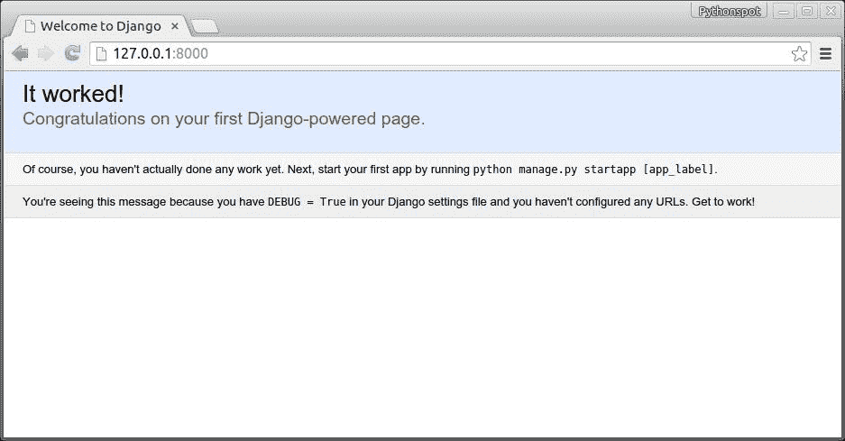
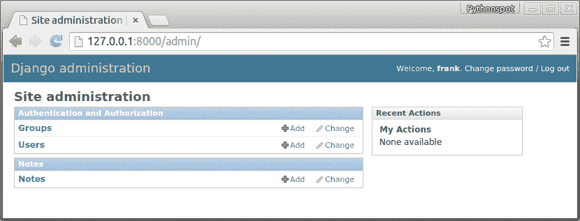
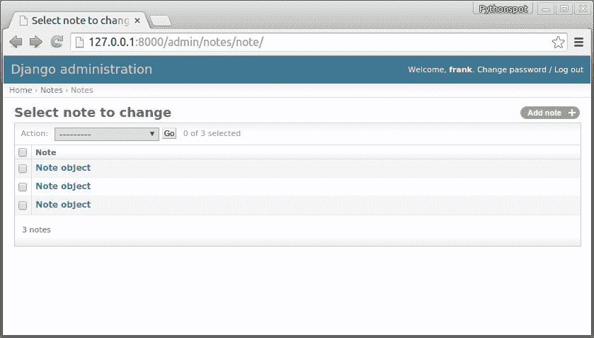
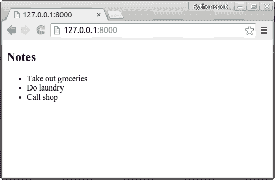
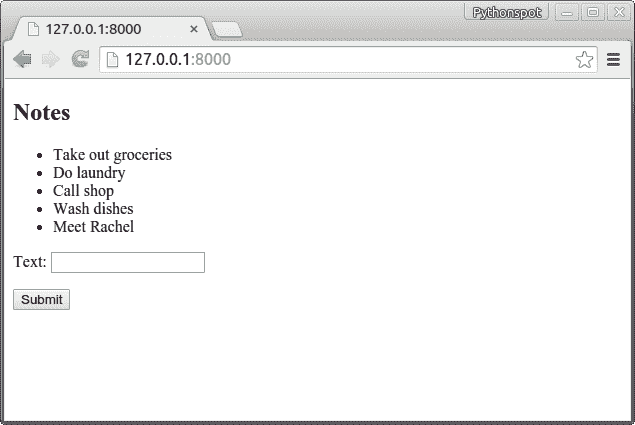
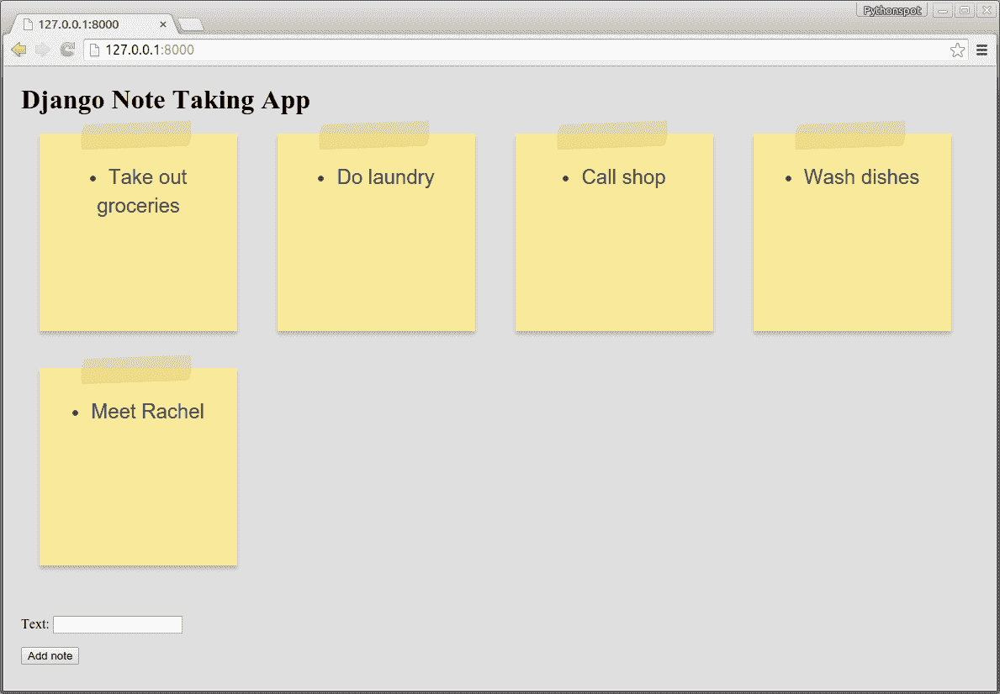

# Django 教程：构建笔记应用程序

> 原文： [https://pythonspot.com/django-tutorial-building-a-note-taking-app/](https://pythonspot.com/django-tutorial-building-a-note-taking-app/)

## Django

如果要开始 python Web 开发，可以使用一个名为 Django 的 Web 框架。它被设计为快速，安全和可扩展的。 它带有一个对象关系映射器（ORM），这意味着 Python 中的对象被映射到数据库中的对象。

用 Django 创建的应用程序分为三个独立的层：模型（数据库），视图（外观）和控制器（逻辑），或者简称为模型-视图-控制器（MVC）体系结构。

## 设置 Django

Start with:

```py
django-admin startproject mysite
```

这将创建目录`mysite`。 打开`mysite/mysite/settings.py`。您可以在此处配置所需的数据库：

```py
1
2
3
4
5
6
7

```

从 sqlite3，postgresql_psycopg2，mysql 或 oracle 中选择。 名称是您的数据库的名称。 如果您使用 SQLite，则会自动创建数据库。 对于 MySQL 和 Postgresql，您需要自己创建数据库。 将一个目录转到/ mysite /并运行：

```py
1
2

```

终端应该说：

```py
1
2
3
4
5
6
7
8
9
10
11
12
13
14

```

在网络浏览器中打开 [http://127.0.0.1:8000](http://127.0.0.1:8000) ，您应该看到：



我们的第一个 Django 应用。

现在我们创建了一个项目，我们创建了一个应用程序。 一个项目可以有许多应用程序。

```py
python manage.py startapp notes

```

This creates the files:

```py
notes/
    init.py
    admin.py
    migrations/
        init.py
    models.py
    tests.py
    views.py
```

## Django 数据库模型

将`/mysite/notes/models.py`更改为：

```py
1
2
3
4
5
6

```

打开/mysite/mysite/settings.py，添加 Web 应用程序：

```py
1
2
3
4
5
6
7
8
9

```

跑

```py
python manage.py syncdb

```

这将更新数据库。 然后，我们将`/mysite/mysite/admin.py`更新为：

```py
1
2
3
4
5
6
7
8
9
10
11

```

跑：

```py
1
2

```

使用以下命令启动服务器：

```py
manage.py runserver

```

一旦打开管理面板 [http://127.0.0.1:8000/admin](http://127.0.0.1:8000/admin)，便笺将出现在页面上：



Django admin panel

如果单击便笺，则可以查看所有便笺并添加/删除它们：



Django 数据库管理菜单。

## 显示数据

我们将所有数据存储在数据库中，现在我们要创建应用程序。 打开`/mysite/settings.py`并添加：

```py
1
2
3
4
5
6
7

```

到文件底部。 这定义了模板的目录（html）。

将`/mysite/mysite/urls.py`更改为：

```py
1
2
3
4
5
6
7
8
9
10
11

```

最后，创建`/mysite/static/templates/`并添加`note.html`，这是一个简单的静态 html 文件。

```py
1
2
3
4
5

```

打开 [http://127.0.0.1:8000/](http://127.0.0.1:8000/) 进行测试。 将`note.html`更改为：

```py
1
2
3
4
5

```

然后打开`/mysite/notes/views.py`并更改为：

```py
1
2
3
4
5
6
7
8
9
10
11
12
13
14

```

启动浏览器后，您将看到便签列表：



django 应用

## 插入数据

虽然有一个列表很不错，但我们想在其中添加一些注释。创建文件`/mysite/notes/forms.py`

```py
1
2
3
4
5
6
7
8

```

将`view.py`更改为：

```py
1
2
3
4
5
6
7
8
9
10
11
12
13
14
15
16
17
18
19
20

```

最后，我们将`note.html`更新为：

```py
1
2
3
4
5
6
7
8
9
10
11

```

运行它，我们有记笔记的应用程序 :-)



Djano note taking app

## 为应用添加样式

通过修改`note.html`，我们可以像其他任何 html/css 网站一样设置其样式。 如果将`note.html`更改为：

```py
1
2
3
4
5
6
7
8
9
10
11
12
13
14
15
16

```

你会得到：



Django 笔记记录应用