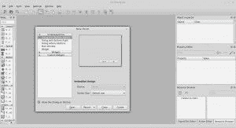

# PyQT4 教程

> 原文： [https://pythonspot.com/pyqt4/](https://pythonspot.com/pyqt4/)

PyQt 被广泛用于开发可在各种操作系统上运行的图形界面。 它是 Python 编程中最受欢迎的 GUI 选择之一。

*   [使用 PyQt5 创建 GUI 应用](https://gum.co/pysqtsamples)

## 文章

您可以在下面找到 PyQT 文章的集合。

可以使用 QT Designer 设计应用程序

*   [QT4 窗口](https://pythonspot.com/qt4-window/ "QT4 Window")
*   [QT4 按钮](https://pythonspot.com/qt4-buttons/ "QT4 Buttons")
*   [QT4 消息框](https://pythonspot.com/qt4-messagebox/ "QT4 Messagebox")
*   [QT4 菜单](https://pythonspot.com/qt4-menu/ "QT4 Menu")
*   [QT4 小部件](https://pythonspot.com/qt4-widgets/ "QT4 Widgets")
*   [QT4 文本框](https://pythonspot.com/qt4-textbox-example/)
*   [QT4 表格](https://pythonspot.com/qt4-table/)
*   [QT4 标签](https://pythonspot.com/qt4-tabs/)
*   [QT4 进度条](https://pythonspot.com/qt4-progressbar/)
*   [QT4 像素图（图像）](https://pythonspot.com/qt4-pixmaps-images/)
*   [QT4 打开文件对话框](https://pythonspot.com/qt4-file-dialog/)
*   [QT4：构建应用程序（初学者教程）](https://pythonspot.com/building-an-application-gui-with-pyqt-beginners-tutorial/)
*   [QT4：使用设计器创建 GUI（专业教程）](https://pythonspot.com/qml-and-pyqt-creating-a-gui-tutorial/)

## 真实示例

使用 PyQt 的程序示例

*   Dropbox
*   Ninja IDE
*   Veusz