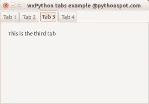

# wxPython

> 原文： [https://pythonspot.com/wx/](https://pythonspot.com/wx/)

一个 wxPython 应用程序

在本教程系列中，您将学习使用 wxPython 模块进行[图形（GUI）编程](https://pythonspot.com/gui)的基础。 它是跨平台的：应用程序可以在 Microsoft Windows，Apple OS X 和大多数 Unix 系统上运行。

使用 **wxPython** 制作的应用程序具有本机系统界面，而无需更改代码。

**相关课程：** [使用 wxPython 创建 GUI 应用程序](https://gum.co/qapqB)

## 目录

*   [Wx 窗口](https://pythonspot.com/wxpython-window/)
*   [Wx 按钮](https://pythonspot.com/wxpython-buttons/)
*   [Wx 对话框](https://pythonspot.com/wxpython-dialogs/)
*   [Wx 文件对话框](https://pythonspot.com/wxpython-file-dialog/)
*   [Wx 输入对话框](https://pythonspot.com/wxpython-input-dialog/)
*   [Wx 文件菜单](https://pythonspot.com/wxpython-menu-2)
*   [Wx 标签](https://pythonspot.com/wxpython-tabs/)
*   [Wx 创建 GUI](https://pythonspot.com/creating-a-gui-in-python-with-wxwidgets-tutorial-for-beginners/ "Creating a gui in Python with WxWidgets [tutorial for beginners]")