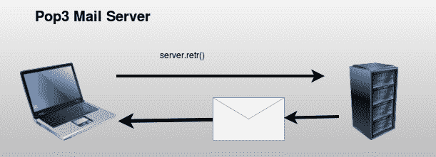

# 读取电子邮件，pop3

> 原文： [https://pythonspot.com/read-email-pop3/](https://pythonspot.com/read-email-pop3/)

在本教程中，您将学习如何使用 **poplib** 模块来**接收电子邮件**。 邮件服务器需要支持 **pop3** ，但是大多数邮件服务器都支持。 邮局协议（POP3）仅用于接收邮件，发送时需要 SMTP 协议。



Simplified Mail Server

## 元数据

Every email will contain many variables, but these are the most important ones:

| 特征 | 描述 |
| --- | --- |
| 消息 ID | 唯一标识符 |
| 从 | 电子邮件来自哪里？ |
| 至 | 电子邮件发送到哪里了？ |
| 日期 | 日期 |
| 学科 | 电子邮件主题。 |

## 读取电子邮件示例

You can request messages directly from a mail server using the Post Office Protocol (protocol). You do not have to worry about the internal protocol because you can use the poplib module.
Connect and authenticate with the server using:

```py

# connect to server
server = poplib.POP3(SERVER)

# login
server.user(USER)
server.pass_(PASSWORD)

```

The program below gets 10 emails from the server including mail header

```py

import poplib
import string, random
import StringIO, rfc822

def readMail():
    SERVER = "YOUR MAIL SERVER"
    USER = "YOUR USERNAME [email protected]COM"
    PASSWORD = "YOUR PASSWORD"

    # connect to server
    server = poplib.POP3(SERVER)

    # login
    server.user(USER)
    server.pass_(PASSWORD)

    # list items on server
    resp, items, octets = server.list()

    for i in range(0,10):
        id, size = string.split(items[i])
        resp, text, octets = server.retr(id)

        text = string.join(text, "\n")
        file = StringIO.StringIO(text)

        message = rfc822.Message(file)

        for k, v in message.items():
            print k, "=", v

readMail()

```