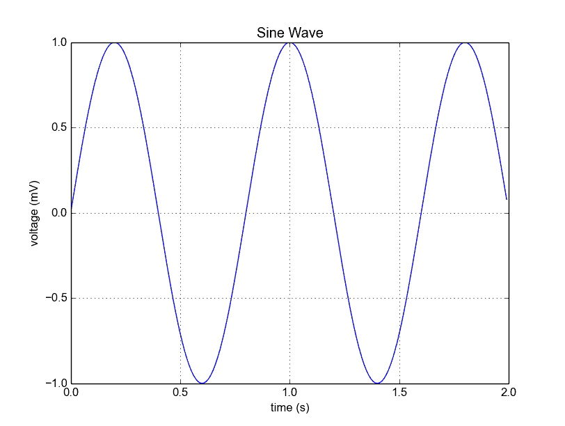
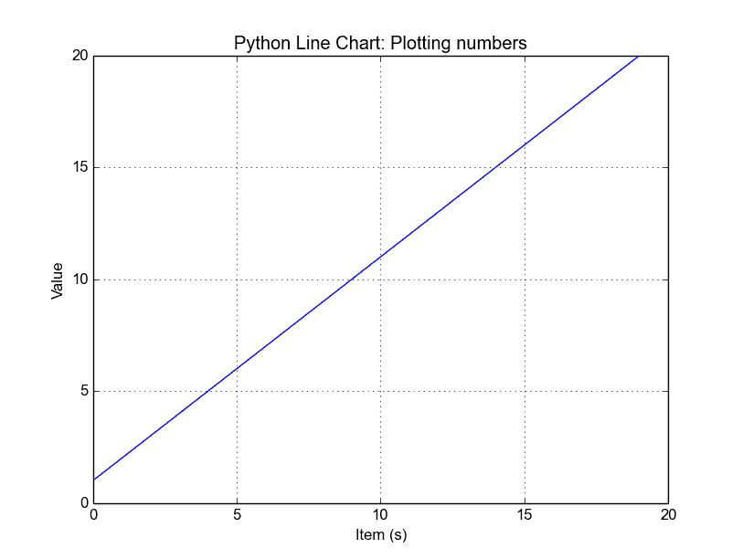
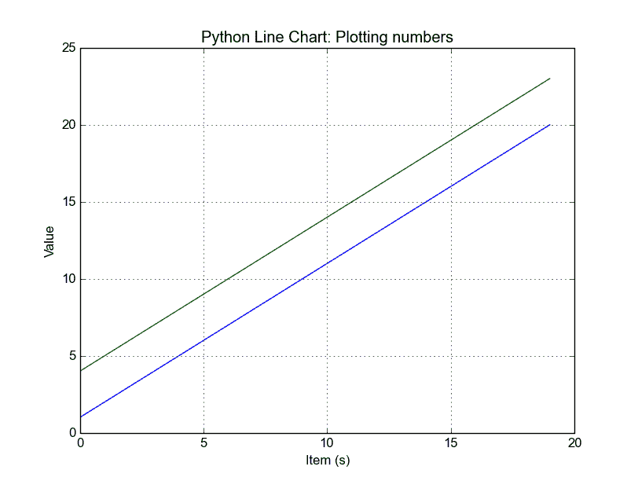

# Matplotlib 折线图

> 原文： [https://pythonspot.com/matplotlib-line-chart/](https://pythonspot.com/matplotlib-line-chart/)

可以使用 [**Matplotlib**](https://pythonspot.com/matplotlib/)plot（）函数创建折线图。 尽管我们可以绘制一条线，但我们不仅限于此。 我们可以显式定义网格，x 和 y 轴比例以及标签，标题和显示选项。

## 折线图示例

下面的示例将创建一个折线图。

```py
from pylab import *
t = arange(0.0, 2.0, 0.01)
s = sin(2.5*pi*t)
plot(t, s)

xlabel('time (s)')
ylabel('voltage (mV)')
title('Sine Wave')
grid(True)
show()

```

输出：



Python [**Matplotlib**](https://pythonspot.com/matplotlib/) 折线图

这些行：

```py
from pylab import *

t = arange(0.0, 2.0, 0.01)
s = sin(2.5*pi*t)

```

只需定义要绘制的数据。

```py
from pylab import *

t = arange(0.0, 2.0, 0.01)
s = sin(2.5*pi*t)
plot(t, s)
show()

```

绘制图表。 其他语句非常简单：语句 xlabel（）设置 x 轴文本，ylabel（）设置 y 轴文本，title（）设置图表标题，grid（True）只是打开网格。

如果要将图保存到磁盘，请调用以下语句：

```py
savefig("line_chart.png")

```

## 绘制自定义折线图


如果要使用数组（列表）进行绘制，则可以执行以下脚本：

```py
from pylab import *

t = arange(0.0, 20.0, 1)
s = [1,2,3,4,5,6,7,8,9,10,11,12,13,14,15,16,17,18,19,20]
plot(t, s)

xlabel('Item (s)')
ylabel('Value')
title('Python Line Chart: Plotting numbers')
grid(True)
show()

```

该声明：

```py
t = arange(0.0, 20.0, 1)

```

定义从 0 开始，以 1 为步长绘制 20 个项目（数组的长度）。

输出：



来自列表的 Python 折线图

## 多个图


如果要在一张图表中绘制多条线，只需多次调用 plot（）函数。 一个例子：

```py
from pylab import *

t = arange(0.0, 20.0, 1)
s = [1,2,3,4,5,6,7,8,9,10,11,12,13,14,15,16,17,18,19,20]
s2 = [4,5,6,7,8,9,10,11,12,13,14,15,16,17,18,19,20,21,22,23]
plot(t, s)
plot(t, s2)

xlabel('Item (s)')
ylabel('Value')
title('Python Line Chart: Plotting numbers')
grid(True)
show()

```

输出：



python 多个折线图

如果要在同一窗口中的不同视图中绘制它们，可以使用以下方法：

```py
import matplotlib.pyplot as plt
from pylab import *

t = arange(0.0, 20.0, 1)
s = [1,2,3,4,5,6,7,8,9,10,11,12,13,14,15,16,17,18,19,20]
s2 = [4,5,6,7,8,9,10,11,12,13,14,15,16,17,18,19,20,21,22,23]

plt.subplot(2, 1, 1)
plt.plot(t, s)
plt.ylabel('Value')
plt.title('First chart')
plt.grid(True)

plt.subplot(2, 1, 2)
plt.plot(t, s2)
plt.xlabel('Item (s)')
plt.ylabel('Value')
plt.title('Second chart')
plt.grid(True)
plt.show()

```

输出：


Python 子图

这里的 plt.subplot（）语句是关键。 subplot（）命令指定数字，数字和数字。

## 设置图的样式

如果要粗线或设置颜色，请使用：

```py
plot(t, s, color="red", linewidth=2.5, linestyle="-")

```

[下载示例](https://pythonspot.com/download-matplotlib-examples/)