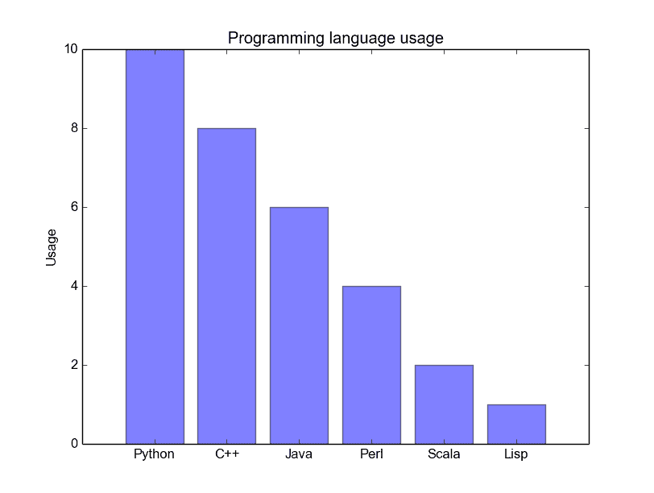
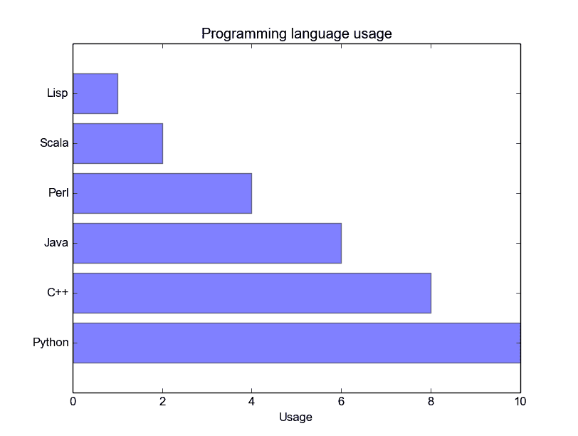
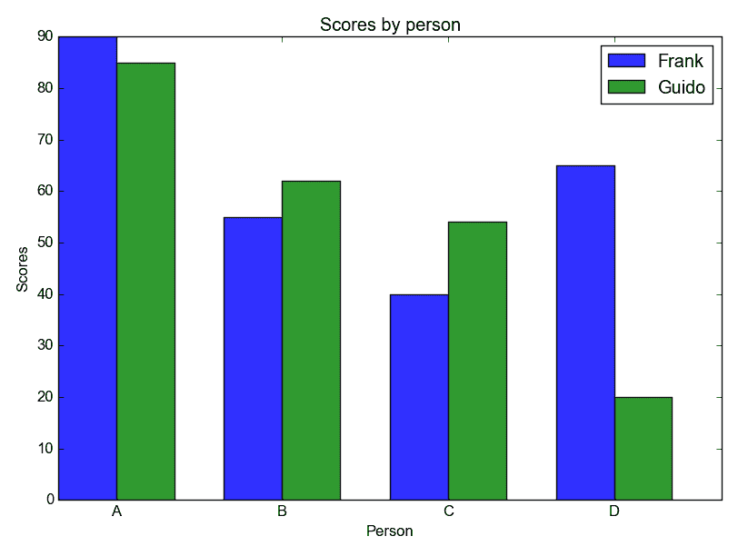

# Matplotlib 条形图

> 原文： [https://pythonspot.com/matplotlib-bar-chart/](https://pythonspot.com/matplotlib-bar-chart/)

[Matplotlib](https://pythonspot.com/matplotlib/) 可用于创建条形图。 您可能喜欢 [Matplotlib 图库](https://pythonspot.com/matplotlib-gallery/)。

## 条形图代码

The code below creates a bar chart:

```py
import matplotlib.pyplot as plt; plt.rcdefaults()
import numpy as np
import matplotlib.pyplot as plt

objects = ('Python', 'C++', 'Java', 'Perl', 'Scala', 'Lisp')
y_pos = np.arange(len(objects))
performance = [10,8,6,4,2,1]

plt.bar(y_pos, performance, align='center', alpha=0.5)
plt.xticks(y_pos, objects)
plt.ylabel('Usage')
plt.title('Programming language usage')

plt.show()

```

输出：



Python Bar Chart

[Matplotlib](https://pythonspot.com/matplotlib/) 图表可以是水平的，以创建水平条形图：

```py
import matplotlib.pyplot as plt; plt.rcdefaults()
import numpy as np
import matplotlib.pyplot as plt

objects = ('Python', 'C++', 'Java', 'Perl', 'Scala', 'Lisp')
y_pos = np.arange(len(objects))
performance = [10,8,6,4,2,1]

plt.barh(y_pos, performance, align='center', alpha=0.5)
plt.yticks(y_pos, objects)
plt.xlabel('Usage')
plt.title('Programming language usage')

plt.show()

```

输出：



Bar chart horizontal

## 有关条形图的更多信息

您可以使用以下 [Matplotlib](https://pythonspot.com/matplotlib/) 代码比较两个数据系列：

```py
import numpy as np
import matplotlib.pyplot as plt

# data to plot
n_groups = 4
means_frank = (90, 55, 40, 65)
means_guido = (85, 62, 54, 20)

# create plot
fig, ax = plt.subplots()
index = np.arange(n_groups)
bar_width = 0.35
opacity = 0.8

rects1 = plt.bar(index, means_frank, bar_width,
alpha=opacity,
color='b',
label='Frank')

rects2 = plt.bar(index + bar_width, means_guido, bar_width,
alpha=opacity,
color='g',
label='Guido')

plt.xlabel('Person')
plt.ylabel('Scores')
plt.title('Scores by person')
plt.xticks(index + bar_width, ('A', 'B', 'C', 'D'))
plt.legend()

plt.tight_layout()
plt.show()

```

输出：



Python Bar Chart comparison

[下载所有 Matplotlib 示例](https://pythonspot.com/download-matplotlib-examples/)