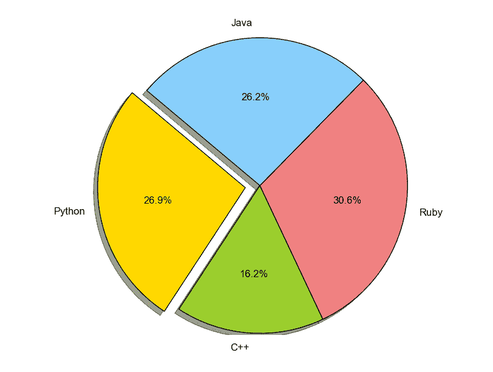
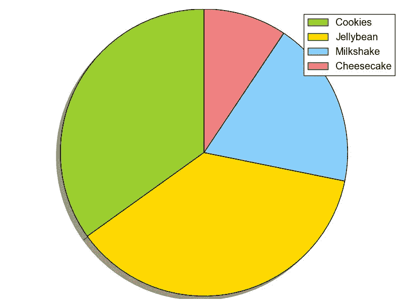

# Matplotlib 饼图

> 原文： [https://pythonspot.com/matplotlib-pie-chart/](https://pythonspot.com/matplotlib-pie-chart/)

[Matplotlib](https://pythonspot.com/matplotlib/) 使用`pie()`函数支持饼图。 您可能喜欢 [Matplotlib 图库](https://pythonspot.com/matplotlib-gallery/)。

## Matplotlib 饼图

下面的代码创建一个饼图：

```py
import matplotlib.pyplot as plt

# Data to plot
labels = 'Python', 'C++', 'Ruby', 'Java'
sizes = [215, 130, 245, 210]
colors = ['gold', 'yellowgreen', 'lightcoral', 'lightskyblue']
explode = (0.1, 0, 0, 0)  # explode 1st slice

# Plot
plt.pie(sizes, explode=explode, labels=labels, colors=colors,
autopct='%1.1f%%', shadow=True, startangle=140)

plt.axis('equal')
plt.show()

```

输出：



python 饼图

要添加图例，请使用`plt.legend()`函数：

```py
import matplotlib.pyplot as plt

labels = ['Cookies', 'Jellybean', 'Milkshake', 'Cheesecake']
sizes = [38.4, 40.6, 20.7, 10.3]
colors = ['yellowgreen', 'gold', 'lightskyblue', 'lightcoral']
patches, texts = plt.pie(sizes, colors=colors, shadow=True, startangle=90)
plt.legend(patches, labels, loc="best")
plt.axis('equal')
plt.tight_layout()
plt.show()

```

输出：



python 饼图

[下载所有 Matplotlib 示例](https://pythonspot.com/download-matplotlib-examples/)