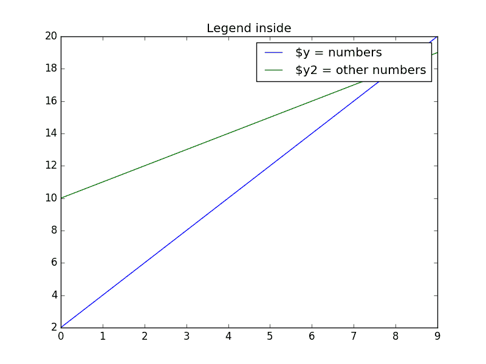
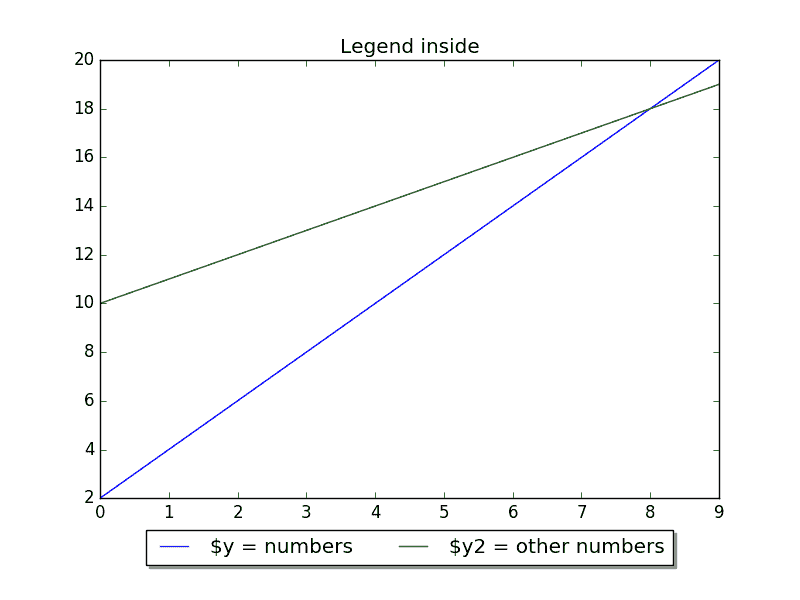
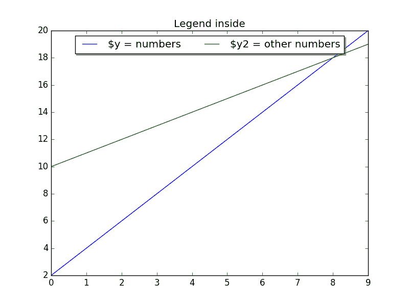
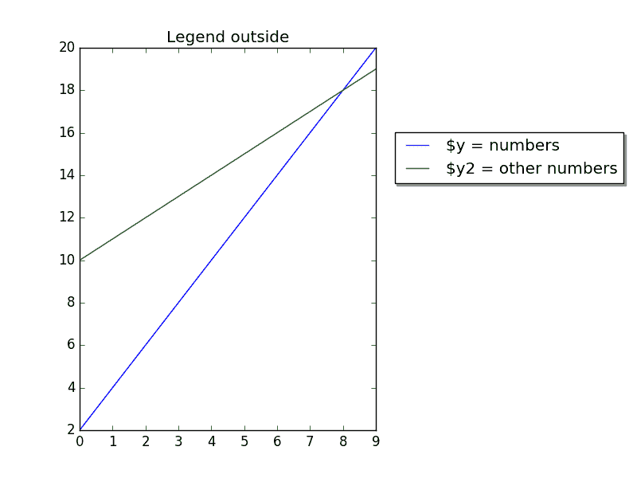

# Matplotlib 图例

> 原文： [https://pythonspot.com/matplotlib-legend/](https://pythonspot.com/matplotlib-legend/)

Matplotlib 对图例具有本机支持。 图例可以放置在各个位置：图例可以放置在图表的内部或外部，并且可以移动位置。

legend（）方法将图例添加到绘图中。 在本文中，我们将向您展示一些使用 matplotlib 的图例示例。

## Matplotlib 内部图例

要将图例放置在内部，只需调用 legend（）：

```py

import matplotlib.pyplot as plt
import numpy as np

y = [2,4,6,8,10,12,14,16,18,20]
y2 = [10,11,12,13,14,15,16,17,18,19]
x = np.arange(10)
fig = plt.figure()
ax = plt.subplot(111)
ax.plot(x, y, label='$y = numbers')
ax.plot(x, y2, label='$y2 = other numbers')
plt.title('Legend inside')
ax.legend()
plt.show()

```



[Matplotlib](https://pythonspot.com/matplotlib/) legend inside

## Matplotlib 底部图例

要将图例置于底部，请将 legend（）调用更改为：

```py

ax.legend(loc='upper center', bbox_to_anchor=(0.5, -0.05),&nbsp; shadow=True, ncol=2)

```

考虑到我们设置了列数 _ncol = 2_ 并设置了阴影。

完整的代码为：

```py

import matplotlib.pyplot as plt
import numpy as np

y = [2,4,6,8,10,12,14,16,18,20]
y2 = [10,11,12,13,14,15,16,17,18,19]
x = np.arange(10)
fig = plt.figure()
ax = plt.subplot(111)
ax.plot(x, y, label='$y = numbers')
ax.plot(x, y2, label='$y2 = other numbers')
plt.title('Legend inside')
ax.legend(loc='upper center', bbox_to_anchor=(0.5, -0.05),&nbsp; shadow=True, ncol=2)
plt.show()

```



Legend placed on bottom

## Matplotlib 顶部图例

要将图例放在顶部，请更改 bbox_to_anchor 值：

```py

ax.legend(loc='upper center', bbox_to_anchor=(0.5, 1.00),&nbsp; shadow=True, ncol=2)

```

码：

```py

import matplotlib.pyplot as plt
import numpy as np

y = [2,4,6,8,10,12,14,16,18,20]
y2 = [10,11,12,13,14,15,16,17,18,19]
x = np.arange(10)
fig = plt.figure()
ax = plt.subplot(111)
ax.plot(x, y, label='$y = numbers')
ax.plot(x, y2, label='$y2 = other numbers')
plt.title('Legend inside')
ax.legend(loc='upper center', bbox_to_anchor=(0.5, 1.00), shadow=True, ncol=2)
plt.show()

```



Legend on top

## 外部右侧图例

我们可以通过调整框的大小并相对于图例放置图例来在外部放置图例：

```py

chartBox = ax.get_position()
ax.set_position([chartBox.x0, chartBox.y0, chartBox.width*0.6, chartBox.height])
ax.legend(loc='upper center', bbox_to_anchor=(1.45, 0.8), shadow=True, ncol=1)

```

码：

```py

import matplotlib.pyplot as plt
import numpy as np

y = [2,4,6,8,10,12,14,16,18,20]
y2 = [10,11,12,13,14,15,16,17,18,19]
x = np.arange(10)
fig = plt.figure()
ax = plt.subplot(111)
ax.plot(x, y, label='$y = numbers')
ax.plot(x, y2, label='$y2 = other numbers')
plt.title('Legend outside')
chartBox = ax.get_position()
ax.set_position([chartBox.x0, chartBox.y0, chartBox.width*0.6, chartBox.height])
ax.legend(loc='upper center', bbox_to_anchor=(1.45, 0.8), shadow=True, ncol=1)
plt.show()

```



[Matplotlib](https://pythonspot.com/matplotlib/) legend outside

[下载示例](https://pythonspot.com/download-matplotlib-examples/)