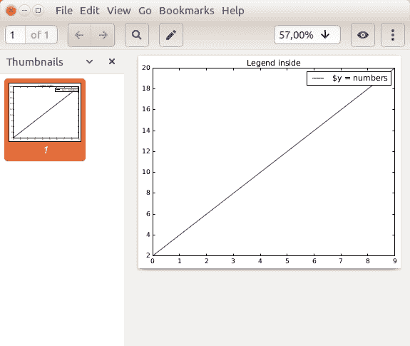

# Matplotlib 将图形保存到图像文件

> 原文： [https://pythonspot.com/matplotlib-save-figure-to-image-file/](https://pythonspot.com/matplotlib-save-figure-to-image-file/)

## 保存图形

[Matplotlib](https://pythonspot.com/matplotlib/) can save plots directly to a file using savefig().
The method can be used like this:

```py

fig.savefig('plot.png')

```

完整的例子：

```py

import matplotlib
import matplotlib.pyplot as plt
import numpy as np

y = [2,4,6,8,10,12,14,16,18,20]
x = np.arange(10)
fig = plt.figure()
ax = plt.subplot(111)
ax.plot(x, y, label='$y = numbers')
plt.title('Legend inside')
ax.legend()
#plt.show()

fig.savefig('plot.png')

```

要更改格式，只需更改扩展名，如下所示：

```py

fig.savefig('plot.pdf')

```

您可以使用打开文件

```py

display plot.png

```

或在图片或 pdf 查看器中打开它，



A plot saved to a pdf

[下载示例](https://pythonspot.com/download-matplotlib-examples/)