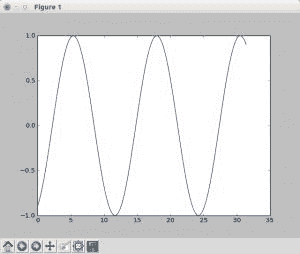

# Matplotlib 更新图

> 原文： [https://pythonspot.com/matplotlib-update-plot/](https://pythonspot.com/matplotlib-update-plot/)

更新 [**matplotlib**](https://pythonspot.com/matplotlib/)图非常简单。 创建数据，绘图并循环更新。
启用交互模式至关重要：plt.ion（）。 这控制是否通过每个 draw（）命令重绘图形。 如果它为 False（默认值），则该图不会自动更新。

## Related course:


*   [使用 Matplotlib 和 Python 进行数据可视化](https://gum.co/mpdp)

## 更新图示例

复制下面的代码以测试交互式绘图。

```py

import matplotlib.pyplot as plt
import numpy as np

x = np.linspace(0, 10*np.pi, 100)
y = np.sin(x)

plt.ion()
fig = plt.figure()
ax = fig.add_subplot(111)
line1, = ax.plot(x, y, 'b-')

for phase in np.linspace(0, 10*np.pi, 100):
line1.set_ydata(np.sin(0.5 * x + phase))
fig.canvas.draw()

```



Capture of a frame of the program above

## 说明

我们使用以下方法创建要绘制的数据：

```py

x = np.linspace(0, 10*np.pi, 100)
y = np.sin(x)

```

使用以下命令打开交互模式：

```py

plt.ion()

```

配置图（“ b-”表示蓝线）：

```py

fig = plt.figure()
ax = fig.add_subplot(111)
line1, = ax.plot(x, y, 'b-')

```

最后循环更新：

```py

for phase in np.linspace(0, 10*np.pi, 100):
line1.set_ydata(np.sin(0.5 * x + phase))
fig.canvas.draw()

```

[下载示例](https://pythonspot.com/download-matplotlib-examples/)