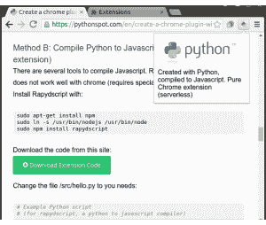
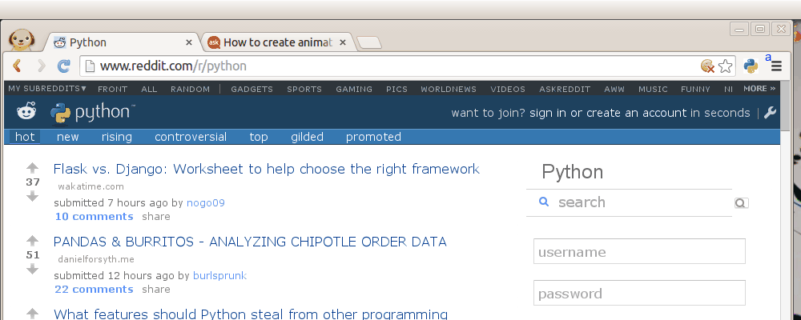

# 使用 Python 创建 Chrome 插件

> 原文： [https://pythonspot.com/create-a-chrome-plugin-with-python/](https://pythonspot.com/create-a-chrome-plugin-with-python/)



使用 Python 创建的 Google Chrome 扩展程序（无服务器，方法B）。

Google Chrome 插件使用 HTML，JavaScript 和 CSS 编写。 如果您以前从未编写过 Chrome 插件，我推荐 [chrome 扩展程序文档](https://developer.chrome.com/extensions/getstarted)。

您可以使用 Python 代替 JavaScript，在本教程中，我们将向您展示如何做到这一点。

很忙？从此站点下载代码：

[下载扩展代码](https://pythonspot.com/en/download-code/?id=L3dwLWNvbnRlbnQvdXBsb2Fkcy8yMDE2LzA4L2Nocm9tZS1leHRlbnNpb24tdHV0b3JpYWwuemlw)（并向下滚动到方法 B）

## 创建一个 Google Chrome 插件

首先，我们必须创建一个清单文件：`manifest.json`。

```py
{
  "manifest_version": 2,

  "name": "Python Chrome Plugin",
  "description": "This extension runs Python code.",
  "version": "1.0",

  "browser_action": {
    "default_icon": "icon.png",
    "default_popup": "popup.html"
  },
  "permissions": [
    "activeTab",
    "https://ajax.googleapis.com/"
  ]
}

```

创建一个名为`popup.html`的文件

```py
<!doctype html>
<!--
 This page is shown when the extension button is clicked, because the
 "browser_action" field in manifest.json contains the "default_popup" key with
 value "popup.html".
 -->
<html>
  <head>
    <title>Getting Started Extension's Popup</title>
    <style>
      body {
        font-family: "Segoe UI", "Lucida Grande", Tahoma, sans-serif;
        font-size: 100%;
      }
      #status {
        /* avoid an excessively wide status text */
        white-space: pre;
        text-overflow: ellipsis;
        overflow: hidden;
        max-width: 400px;
      }
    </style>

    <!--
      - JavaScript and HTML must be in separate files: see our Content Security
      - Policy documentation[1] for details and explanation.
      -
      - [1]: https://developer.chrome.com/extensions/contentSecurityPolicy
     -->
    <script src="popup.js"></script>
  </head>
  <body>
    <div id="status"></div>
    
  </body>
</html>

```

最后得到一个图标，并将其另存为`icon.png`。 打开 [chrome://extensions](chrome://extensions)，然后按开发人员模式。 按“加载解压的扩展”，选择目录，然后按 OK。

## 将 Python 添加到 Chrome 扩展程序

我们有两个选项可将 Python 添加到 chrome 扩展中：

*   方法 A：将 Brython 包含在 iframe 中（需要服务器）

*   方法 B：使用 Rapydscript（最佳，无服务器，纯扩展）将 Python 编译为 Javascript。

## 方法 A：`iframe`中的 Python（Brython）

既然您已经掌握了基本知识，我们就可以将 Python 添加到代码中。要在浏览器中运行 Python，您可以使用多个选项，包括 Brython 和 emcascripten。我们决定尝试 Brython。 我们将从服务器运行 Brython 脚本。将`popup.html`更改为：

```py
<!DOCTYPE html PUBLIC "-//W3C//DTD HTML 4.01 Transitional//EN">
<html>
<head>
<meta charset="iso-8859-1">
<style>
body {    
    margin: 0 !important;
    padding: 0 !important;
    width: 800;
}

#frame {
    overflow: hidden;
    width:790;
    height:324;
}
</style>
</head>
<body onLoad="">
<iframe src=http://brython.info/console.html id="frame" seamless="seamless" scrolling="no"></iframe>
</body>
</html>

```

重新启动插件后，您的 Google Chrome 浏览器中将包含一个 Python（Brython）解释器。



Google Chrome 中的 Python

## 运行您自己的脚本

要运行您自己的脚本，只需更改 popup.html 框架内的 url：

```py
<iframe src="BRYTHON SCRIPT URL" id="frame" seamless="seamless" scrolling="no"></iframe>

```

该脚本应在您自己的服务器上运行。 您可以从网络运行任何 Brython 脚本。 使用 Brython，您只需在 script 标签内键入 Python 代码。 看看[这个](view-source:http://brython.info/gallery/hello.html) Brython 示例，或者只是[浏览图库](http://brython.info/gallery/gallery_en.html?lang=en)。

## 方法 B：将 Python 编译为 Javascript（无服务器，纯扩展）

有几种工具可以将 Python 编译为 Javascript。[Rapydscript](http://www.rapydscript.com/)可以正常工作，[Pyjs](http://pyjs.org/) 在 chrome 上无法正常使用（启动时需要特殊参数）。

使用以下命令安装 Rapydscript：

```py

sudo apt-get install npm
sudo ln -s /usr/bin/nodejs /usr/bin/node
sudo npm install rapydscript

```

从此站点下载代码：

[下载扩展代码](https://pythonspot.com/en/download-code/?id=L3dwLWNvbnRlbnQvdXBsb2Fkcy8yMDE2LzA4L2Nocm9tZS1leHRlbnNpb24tdHV0b3JpYWwuemlw)
将文件/src/hello.py 更改为所需的文件：

```py

# Example Python script 
# (for rapydscript, a python to javascript compiler)

#def doHelloMessage():
#    alert('hello')
#doHelloMessage()

# modify html page
document.getElementById("result").innerHTML = 'Compiled Python script in Chrome' 

# write into log 
console.log('hello from python')

```

跑：

```py

./make.sh

```

您可以在/ compiledpythonextension /中找到您的扩展名。 将其作为未打包的扩展程序加载到 chrome 中，并查看其工作情况:-)

## 结论：

Chrome 插件是使用 HTML，JavaScript 和 CSS 创建的。我们可以使用 Python 创建 Python 到 Javascript 编译器（Rapydscript）的常规 Chrome 扩展。
