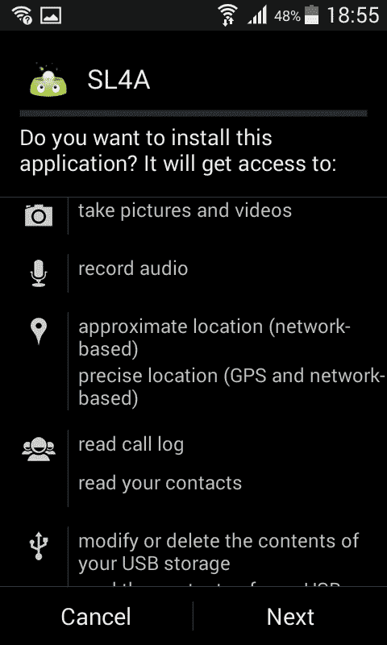
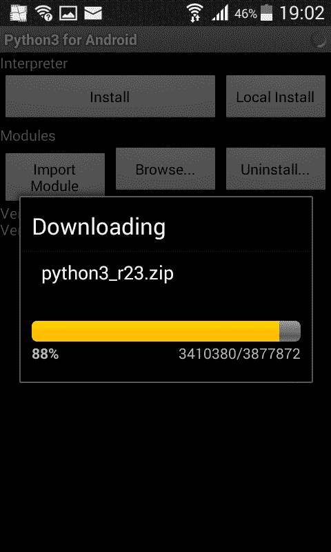
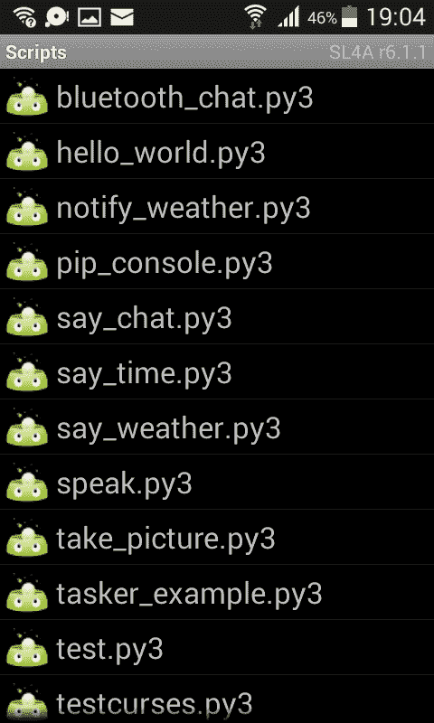
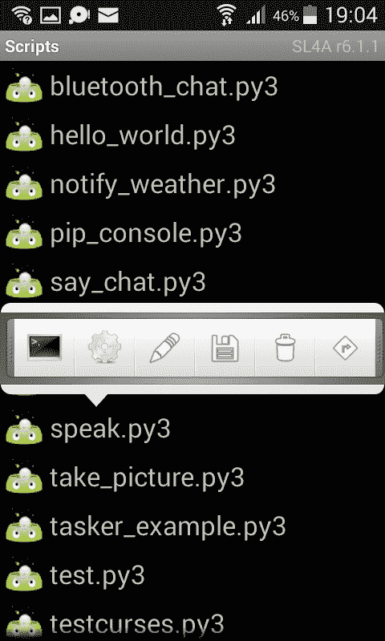

# SL4A：Android Python 脚本

> 原文： [https://pythonspot.com/sl4a-android-python-scripting/](https://pythonspot.com/sl4a-android-python-scripting/)

可以使用 **Android 脚本层（SL4A）**和适用于 Android 的 **Python 解释器**，在 Android 上运行 Python 脚本。

## SL4A

SL4A 项目使在 Android 上编写脚本成为可能，它支持许多编程语言，包括 Python，Perl，Lua，BeanShell，JavaScript，JRuby 和 Shell。 _SL4A 项目有很多 Google 的贡献者，但它不是 Google 的正式项目。_

脚本可以访问 Android 特定的功能，例如呼叫，短信（SMS），拍照，文字转语音，蓝牙等等。

在本文中，您将学习如何**使用 SL4A 在 Android 设备上运行 Python。**

#### SL4A 专为开发人员设计

请记住，SL4A 是为开发人员和 alpha 质量软件设计的。

## 安装 SL4A


QR：SL4A APK 的链接

首先启用来自未知来源的程序的安装。默认情况下，Android 设备只能安装 Google Play 商店中的应用。

您必须通过转到“设置 -> 安全 -> 未知来源”并点击相应的框，以启用“从未知来源安装”权限。

更新这些设置后，请下载 SL4A APK。 在您的 Android 设备上访问 [https://github.com/kuri65536/sl4a](https://github.com/kuri65536/sl4a) 并下载 SL4A APK（ 或使用右侧的 QR 码）。

下载后，将弹出安装菜单，请求您的 Android 设备上的所有权限。



SL4A 权限

## 安装适用于 Android 的 Python 3


适用于 Android Python 3 的 QR Code 

安装 **Py4A 应用程序**。Android 版 Python 应用程序仅在以下平台上运行

Android 设备。您应该将此应用程序与 SL4A 一起使用。

您可以选择任何版本的 Py4A，但请记住，Android 上支持的版本：

*   Python 2 需要 Android 设备&gt; = 1.6

*   Python 3 需要 Android 设备&gt; = 2.3.1

Git 仓库为：[https://github.com/kuri65536/python-for-android/releases](https://github.com/kuri65536/python-for-android/releases)

您还可以通过 Android 设备上的 QR 扫描仪使用右侧的 QR 码。

一旦安装了 Py4A，启动应用程序，然后按安装。 这将安装 Python 解释器。



Android Python 3 安装

## SL4A

再次打开 SL4A。 许多脚本将出现（在列表中）。 您现在可以在 Android 设备上运行 Python 脚本了！



Android 上的 Python

按下诸如`talk.py`之类的程序，将会显示一个小弹出窗口。 按下终端图标将启动 Python 脚本。



SL4A Python 菜单

第三个按钮（铅笔）将打开一个编辑器。 这不是一个完善的 IDE，而是一个简单的编辑器。它没有语法突出显示。

## 在 Android 上编写脚本

您可能更喜欢自己喜欢的 Python 编辑器（这里是 vim/emacs 粉丝？PyCharm？Atom？）

所有脚本都存储在`/sl4a/scripts/`中

#### 注意：文件扩展名

如果您安装了 Python 3 解释器，则程序将以`.py3`扩展名而不是`.py`扩展名显示。

一个简单的程序（太空飞船发射）：

```py

"""TTS Rocket Launch."""

__author__ = 'Frank <[email protected]>'

import android

droid = android.Android()
message = "Python on Android"
droid.ttsSpeak(message)

for i in range(10,0,-1):
    droid.ttsSpeak(str(i))

droid.ttsSpeak("We have lift off!")
droid.ttsSpeak("rrrrrr")

```

更多示例：

[http://www.mattcutts.com/blog/android-barcode-scanner/](http://www.mattcutts.com/blog/android-barcode-scanner/)

[https://github.com/damonkohler/sl4a/blob/wiki/Tutorials.md](https://github.com/damonkohler/sl4a/blob/wiki/Tutorials.md)