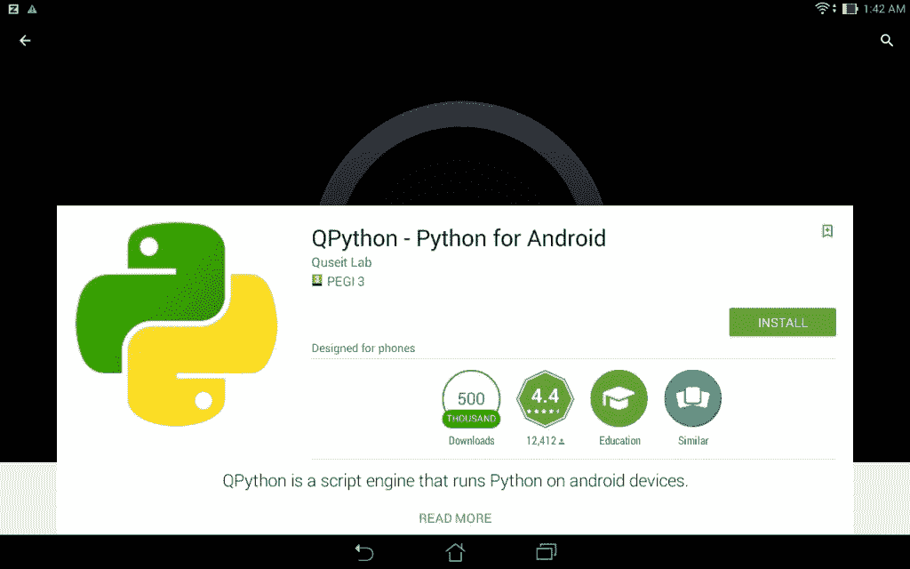
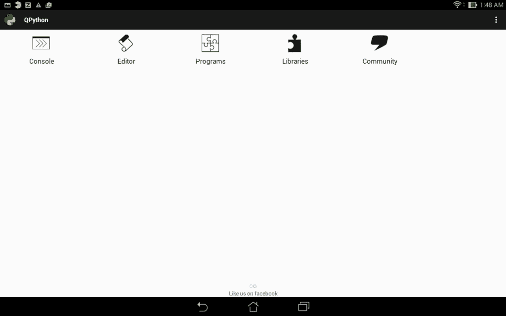
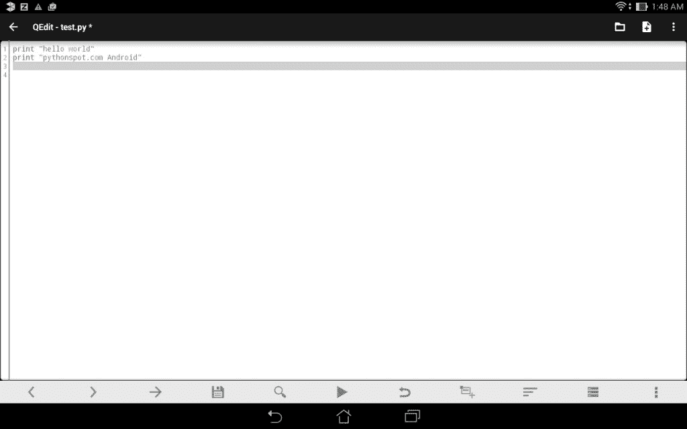
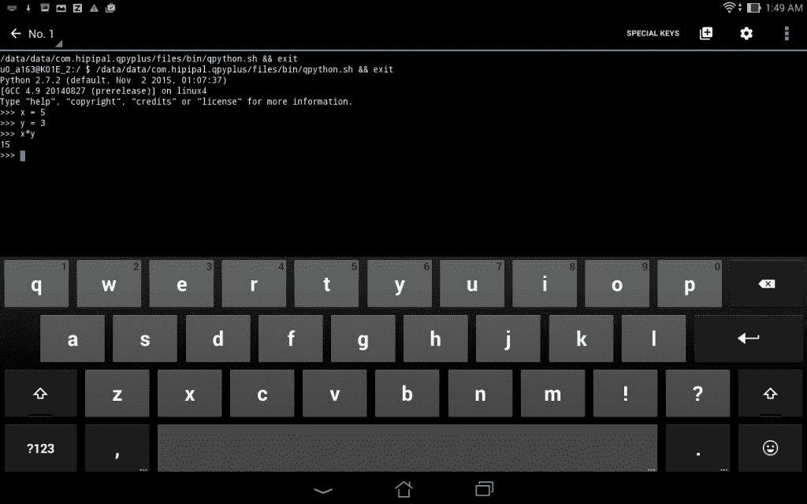

# 使用 QPython 在 Python 中进行 Android 开发

> 原文： [https://pythonspot.com/android-development-in-python-with-qpython/](https://pythonspot.com/android-development-in-python-with-qpython/)

QPython 是一个脚本引擎，可让您在 **Android** 上运行 **Python** 脚本。 如果要制作 **Android** 应用，请改用 Kivy。

## QPython

QPython 应用包含：

*   Android 上的 Python 编程

*   运行脚本/项目

*   Android 上的 IDE

*   点（包管理器）

*   [**SL4A** ](https://pythonspot.com/sl4a-android-python-scripting/)用于 Android 访问（GPS，网络，蓝牙等）

_Please do note QPython is a scripting engine, similar to [SL4A](https://pythonspot.com/sl4a-android-python-scripting/), and not an app development platform._

## 安装

On the Google Playstore you can find both QPython (Python 2.7.2) and QPython3 (Python 3.2.2). We recommend going with Python 3.2.2 but you may want to use Python 2.7.2 for legacy reasons.

Python on Android

## 用法

Once installed you will find yourself in an iconic menu. The first icon will open the Python interpreter.

qpython-menu

## 集成开发环境

The second icon (Editor) will start the Python IDE. It has syntax highlighting and some other features. While its useful to have an IDE on the Android device, typing on a mobile or tablet may not be your preference. All scripts are stored in _/storage/emulated/0/com.hipipal.qpyplus/scripts_. You can upload directly to this directory from your favorite editor on the desktop. (The run button is at the bottom.)

QPython IDE

## 解释器

You can use the Python interpreter directly on your Android device. This is similar to starting the Python interpreter on Windows or Linux. While useful at times, you probably prefer using the IDE.

Python Interpreter on Android